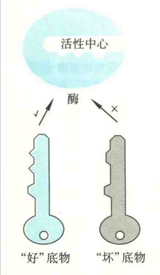
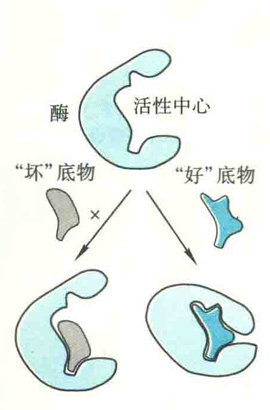
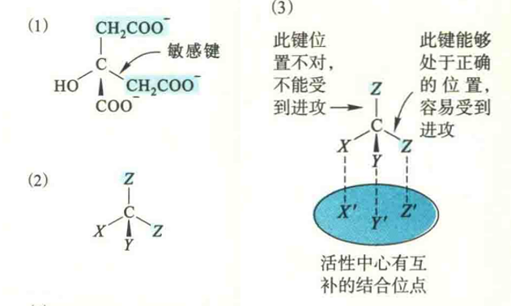

# 酶专一性学说

## “锁与钥匙"模型

Fischer提出此模型的灵感显然来自于“一把钥匙只开一把锁”的生活经验。在该模型中，酶和底物分别被比作锁和钥匙，锁眼相当于是酶的活性中心。只有跟锁眼在结构上完全匹配、吻合的钥匙才能进入其中，再将锁打开。

该模型认为:活性中心的构象是固定不变的，底物的结构（形状、大小、电荷的分布、氢键供体或受体以及疏水补丁等）必须与它的结构非常吻合才能结合。好底物与坏底物的差别在于与活性中心在结构上匹配和吻合的程度。

该模型有很多缺陷:首先它不能解释酶的活性中心为何也能与产物结合并催化逆反应;其次，它对解释酶的催化机制也没有任何帮助（锁对钥匙没有任何作用）。正因为如此，该模型实际上早已被淘汰。

##  “诱导契合”模型

该模型由DanielE.Koshland在1958年提出。

酶活性中心不是僵硬不变的结构，而是具有一定的柔性。酶在与底物结合前后构象是不同的，一开始活性中心并不适合结合底物。然而，一旦底物与酶接近，诱导并开始了。这种诱导是双向的，一方面酶受到底物分子的诱导，其构象发生变化，特别是活性中心的构象;另一方面，底物的构象也会发生变化。

酶和底物双方在构象上的变化，不仅使得酶能更好地结合底物（这有点像戴手套时手套在手的“诱导”下所发生的变化）还能使活性中心的催化基团处于合适的位置，从而能更好地行使催化，这就是契合。“好底物”与“坏底物”的差别就在于，前者与酶结合能诱导酶的构象发生有利于催化的变化，而后者不行。

“诱导契合”模型不仅可以很好地解释酶作用的专一性，还可以有助于解释酶的催化机制，因此该模型早已经被广泛认可。有很多重要的酶，正是巧妙地使用了“诱导契合”，一方面保证了其催化的专一性，另一方面还可以用来防止本来很容易发生的副反应的发生。

### 己糖激酶

以参与糖酵解第一步反应的己糖激酶为例：该酶催化ATP的一个磷酸基团转移给葡萄糖分子的6号位羟基。然而，水和葡萄糖分子都有羟基，两者都可以进入己糖激酶的活性中心，但己糖激酶催化磷酸基团从ATP转移到葡萄糖分子的效率是转移给水分子的10倍。

对此现象，用“锁和钥匙”模型是不能解释的，但“诱导契合”模型却很容易。

因为只有葡萄糖分子进入酶的活性中心以后，才能诱导活性中心的构象发生变化，使活性中心的催化基团处于合适的位置而能更好地进行催化。

因此，从某种意义上来看，葡萄糖通过诱导酶构象的变化而间接地参与了催化反应。

对来源于酵母细胞的己糖激酶所进行的X射线衍射实验表明，整个酶分子由两个相对独立的叶组成，活性中心为两叶之间的裂缝。

当葡萄糖与酶的活性中心结合以后，酶的构象发生了剧烈的变化:作为底物的葡萄糖诱导两叶相向移动，每一叶大约旋转10°，整个多肽链骨架移动了约0.8nm，构成活性中心的裂缝因此而闭合，仿佛河蚌遇到刺激以后两壳闭合。

裂缝的闭合对酶的催化十分重要，原因是:首先它为底物创造了更为疏水的环境，整个葡萄糖分子除了6号位的羟基以外都被疏水氨基酸残基的侧链包围，这非常有利于ATP的转移。

其次，它“赶走”了本来占据在活性中心的水分子，这就防止了酶将ATP的7-磷酸基团误交给水分子而导致ATP水解的副反应的发生。

有人做过这样的实验：使用少一个C原子的木糖代替葡萄糖，结果发现己糖激酶能够催化ATP水解。在这种情况下，ATP之所以发生水解，很可能是因为体积较小的木糖进入活性中心以后，无法赶走“水分子”，反而诱使酶“上当受骗”，将ATP的γ-磷酸转移给留在活性中心的水分子上的羟基。

上述底物诱导的裂缝闭合现象不仅仅发现在己糖激酶，实际上在其他几种参与糖酵解的激酶（包括磷酸果糖激酶、磷酸甘油酸激酶和丙酮酸激酶）分子上也能够观测到，这说明这已成为各种激酶作用的共同特征。

### 脂肪酶

再以催化脂肪水解的脂肪酶为例：该酶的底物主要是不溶于水的脂肪。这种酶对水溶性底物几乎没有任何作用，只能水解位于水相和油相界面的底物。

这是因为酶在水相里，活性中心被它的一段螺旋遮盖住。然而，一旦到了两相的交界处，即受到界面的诱导，酶的构象发生变化，活性中心得以外露，于是便有了活性。

##  “三点附着”模型

对于酶为什么能够区分一对对映异构体，或者一个假手性C上两个相同的基团，需要用酶与底物的“三点附着”模型进行解释。

该模型认为，底物在活性中心的结合有3个结合点，只有当在这3个结合点都匹配的时候，酶才会催化相应的反应。一对对映异构体底物虽然基团相同，但空间排列不同，这就可能出现其中一种与酶结合的时候，无法保证三点都互补匹配，酶也就不能作用于它。

### 顺乌头酸酶

以催化三羧酸循环第二步反应的顺乌头酸酶为例：该酶的底物是图上方显示的柠檬酸，它是在三竣酸循环的第一步反应由草酰乙酸和乙酰辅酶A转变而来的，分子中有两个-CH2-COOH基团，一个来自草酰乙酸，一个来自乙酰辅酶A。这两个-CH2-COOH在我们眼里看起来没有什么两样，但在酶“眼”里却是不同的。

正因为如此，顺乌头酸酶在催化反应的时候，只会将羟基催化转移给来自草酰乙酸的-CH2-COOH，而绝对不会转移给来自乙酰-CoA的-CH2-COOH。

“三点附着”模型不但可用来解释酶的立体专一性，而且可以解释其他非酶蛋白质作用的立体专一性。例如，脑细胞中的一种氨基酸受体只能与L-氨基酸结合，对D-氨基酸没有作用。