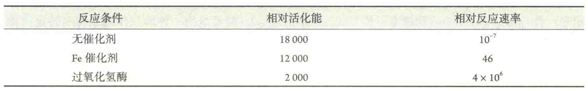

# 酶的催化性质

与非酶催化剂一样，酶只能催化热力学允许的反应，反应完成后本身不被消耗或变化，即可以重复使用。

它对正反应和逆反应的催化作用相同，不改变平衡常数，只加快到达平衡的速率或缩短到达平衡的时间。

受酶催化的化学反应称为酶促反应，其中的反应物称为底物。但作为生物催化剂，酶还具有一些特有的性质：

## 高效性

酶催化效率之高是无与伦比的。与无催化剂的反应相比，酶促反应的速率一般要高10^6~10^12倍，有些反应更高。例如，由5‘-乳清甘酸脱竣酶催化的反应要比无催化剂的反应快10^17倍。若与非酶催化剂催化的反应相比，酶促反应至少也要高几个数量级。

## 酶在活性中心与底物结合

## 高度的专一性

## 反应条件温和

除了发生在一些生活在极端环境下的微生物体内的反应以外，绝大多数酶促反应的条件都十分温和:温度通常是在37℃，压强是在1个标准大气压，pH接近7。

## 对反应条件敏感，容易失活

与一般的化学催化剂相比，酶对反应条件极为敏感，这与酶的化学本质有关。每一种酶都有最佳的反应条件，如最适pH和最适温度等。偏离最佳条件会影响到它的活性，而极端的PH、特定的抑制剂、过高的温度和压强等因素都会导致酶活性的丧失。

## 受到调控

酶的活性，特别是一条代谢途径中的限速酶的活性，是受到严格调控的，调控的方法也是各种各样。

许多酶的活性还需要辅因子的存在

作为辅因子的可能是金属离子，也可能是辅酶或者辅基。作为辅酶或者辅基的多为维生素或其衍生物。

辅因子有的作为第二底物参与反应，如辅酶I和辅酶Ⅱ作为电子和氢的受体或供体，参与氧化还原反应；有的也可以直接参与催化，完成氨基酸侧链基团不能完成的催化任务，例如金属离子、硫胺素焦磷酸和磷酸吡哆醛。

酶除了催化特定的化学反应以外，还有以下功能:

①控制一个反应何时何地进行;

②调节反应的速率;

③防止副反应的发生;

④优化特殊条件下的反应，