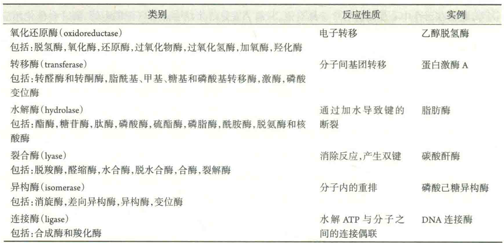

# 酶的分类命名

到目前为止，已有多种不同的酶被纯化，还有很多种酶被结晶。随着酶成员的不断扩充，需要对每一个新的成员进行科学的分类和命名。

## 酶的分类

酶的分类是按照国际生物化学和分子生物学命名委员会的建议，根据反应的性质，将其分为6大类

在每一大类酶中，又可根据不同的标准，分为几个亚类。每一个亚类再分为几个亚亚类。

每一亚亚类中都含有特定的数字编号，作为一个酶在亚亚类中的顺序号。

每一大类、亚类和亚亚类都用具体的数字表示。

例如，乳酸脱氢酶编号为EC1.1.1.27，其中EC表示酶学委员会，4个数字分别表示此酶属于第一大类(氧化还原酶)、此大类中的第一亚类(氧化基团为CHOH)、此亚类中的第一亚亚类(NAD+为H的受体)和在此亚亚类中的顺序号。

## 酶的命名

每一个酶都给予了两个名称，一个为系统名，一个为惯用名。

系统名要求能确切地反映底物的化学本质以及酶的催化性质，因此它由底物名称和反应类型两个部分组成。

如果一个酶促反应的底物不止一种，那需要将所有的底物都注明，中间用“：”隔开。

例如，乳酸脱氢酶的系统名应该是乳酸：NAD+脱氢酶。

惯用名也需要能反映底物名称和反应性质，但不需要非常准确，一般采用底物加反应类型来命名，比如蛋白水解酶、乳酸脱氢酶、磷酸己糖异构酶等。

由于惯用名使用起来比较简便，人们更喜欢用它来称呼一种酶，对于水解酶，人们还习惯省去反应的类型，直接用底物来表示，如蛋白酶、核酸酶、脂肪酶、淀粉酶和ATP酶就分别表示水解蛋白质、核酸、脂肪、淀粉和ATP的水解酶。

有时也会在底物名称前冠以酶的来源，如血清谷丙转氨酶和胰蛋白酶。

惯用名简单，应用156历史长，但由于缺乏系统性，有时难免出现“一酶数名”或“一名数酶”的现象。
