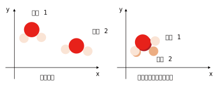
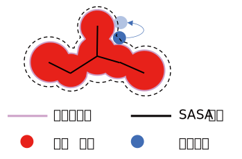
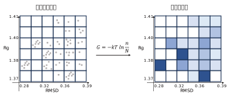

# 分子动力学模拟结果分析

在做完分子动力学模拟后，会得到轨迹文件，该文件中记载了每个模拟时刻的分子构象，我们需要从不同角度对模拟过程进行分析。

本文将详细介绍常见的动力学模拟结果参数、其背后的计算公式、参数反映的物理化学意义，借此更深入地了解动力学模拟到底“在算什么”。

## 结构对齐

**为什么要对齐结构？**

在结果分析中我们只关注体系自身构象的变化，但整个模拟中分子可能出现位移或旋转，如果不采取措施消除位移旋转直接计算的话，会造成结果严重失真，因此需要借助算法将各时刻构象归位到一个统一的点，尽可能消除体系外部变化带来的影响。

例如左图，假设模拟中有一个三原子分子构象并没有发生大的改变，但是在某时刻产生了空间上的位移，这时如果不做对齐矫正，继续用两个时刻的原子坐标计算构象变化，很明显会使数值异常偏大。因为该变化并不是分子构象带来的，而且分子整体发生了位移。

经结构拟合对齐后得到的右图坐标，才能更精确的反应分子结构自身发生了哪些改变，此时使用坐标计算就有了实际意义。

**如何对齐？**

通常是选择模拟中最稳定的构象做参考构象，使用最小二乘法等不同算法调整其他的每个构象的旋转位移属性，使目标构象与参考构象的原子位置重叠度最高。

## RMSD

均方根偏差（RMSD，单位：nm 或 Å）反映了两个构象之间的偏离程度，在动力学分析中可以选择某一构象作为参考（通常是初始构象），用其他各时刻的构象与其计算RMSD，得到RMSD随时间变化的曲线，RMSD值越小表示结构越相似，也就是构象偏离程度越小，可以用于判断体系是否稳定。

$$
RMSD = \sqrt{\frac{1}{N} \sum_{i=1}^{N} (\vec{r}_i - \vec{r}_i')^2} = \sqrt{\frac{1}{N} \sum_{i=1}^{N} [(x_i - x_i')^2 + (y_i - y_i')^2 + (z_i - z_i')^2 ]}
$$

式子中：

$N$：参与计算的原子数量（通常是主链原子）；

$\vec{r}_i$：当前构象中第$i$个原子的三维坐标$(x_i, y_i, z_i)$；

$\vec{r}_i'$：参考构象中第i个原子的三维坐标；

平方和的平方根：将偏差归一化到与坐标同量级

## RMSF

均方根波动（RMSF，单位：nm 或 Å）关注某个原子或某个残基在一段时间内的平均波动程度，RMSF值越大表示该原子的运动越剧烈（柔性越高）。

在选定要计算RMSF的部分后（通常是蛋白质骨架），将会依次计算每个残基在整个模拟时间内的平均波动值，随后按原子数对RMSF作图，可观察整个蛋白质链的柔性/活性区。

$$
\begin{align*}
RMSF_i &= \sqrt{\frac{1}{T} \sum_{t=1}^T (\vec{r}_i(t) - \langle \vec{r}_i \rangle )^2} \\
&= \sqrt{\frac{1}{T} \sum_{t=1}^T [(x_i(t) - \langle x_i \rangle )^2 + (y_i(t) - \langle y_i \rangle )^2 + (z_i(t) - \langle z_i \rangle )^2]} \\
\langle \vec{r}_i \rangle &= \frac{1}{T} \sum_{t=1}^T \vec{r}_i = (\frac{1}{T} \sum_{t=1}^T x_i, \quad \frac{1}{T} \sum_{t=1}^T y_i, \quad \frac{1}{T} \sum_{t=1}^T z_i)
\end{align*}
$$

式子中：

$i$是所计算的第$i$个原子或残基；$T$是模拟的总时间数；

$\vec{r}_i(t)$表示第$t$步构象中要计算的第$i$原子的坐标；

$\langle \vec{r}_i \rangle$是要计算的第$i$个原子在所有构象的平均坐标

## Rg

回旋半径（Rg，单位：nm 或 Å），反映了分子在空间中的伸展程度，对动力学模拟的每个时间步的构象分别计算Rg，即可得到时间对Rg曲线，可分析整个过程中结合构象的伸展变化。

Rg越小的分子构象越紧凑，如折叠的蛋白质；而Rg越大反映分子构象开始伸展，如去折叠的蛋白质、活性口袋打开等。

Rg的计算是原子质量加权的平均距离，需要用体系每个原子的位置和质心位置求距离，再对每个原子对应距离加该原子质量的权重，公式如下：

$$
R_g = \sqrt{\frac{1}{M} \sum_{i=1}^T m_i \cdot (\vec{r}_i - \vec{R})^2}, \quad M = \sum_{i=1}^T m_i
$$

该公式也可以理解为将体系的原点移动到质心位置，式中：

$M$是体系总质量，$\vec{R}$是质心的坐标向量。分子质心代表着所有原子的质量加权平均坐标，计算公式如下：

$$
\vec{R} = (\frac{1}{M} \sum_{i=1}^N m_i \cdot x_i, \quad \frac{1}{M} \sum_{i=1}^N m_i \cdot y_i, \quad \frac{1}{M} \sum_{i=1}^N m_i \cdot z_i)
$$

若采用最简化模型，假设所有原子质量相等，则公式将化简为：

$$
R_g = \sqrt{\frac{1}{N} \sum_{i=1}^N \vec{r}_i^2}
$$

## B-factor

温度因子（B-factor，单位：nm 或 Å）衡量原子在平衡位置附近的波动程度，温度因子和RMSF本质上描述的是同一个物理现象，即原子在平衡位置附近的振动幅度，二者可以通过以下公式换算：

$$
\text{B-factor}_i = \frac{8 \pi}{3} \cdot RMSF_i^2
$$

B-factor 是 RMSF 平方的约 25 倍，二者均反映原子的振动幅度和柔性，B-factor 更贴合实验传统（平方单位）。

在实际研究中，常通过比较模拟计算的 B-factor 与实验值，验证模拟结果的可靠性。同时可以将温度因子的数值映射到蛋白构象颜色中，可视化得到蛋白质的柔性区和刚性区。

## SASA

溶剂可及表面积（SASA，单位：$\text{Å}{}^2$）反映分子表面可以被溶剂分子接触到的面积，SASA值较小且稳定，说明疏水核心被很好地包埋；若模拟中SASA变大，可能反映配体和蛋白发生作用，形成构象转变。

SASA的计算可以通过“滚球算法”完成，该算法将分子中的每个原子视为球体，那么整个分子体系将被视为多个范德华半径球体拼合而成，形成范德华表面。同时溶剂分子也被视为球体，球体半径可以由算法设定，在计算过程中假设溶剂球在分子表面滚动，球体中心得到的表面就是溶剂可及表面，计算它的表面积即为SASA。下图是SASA计算的示意图：

基于这种假设模型，在实际应用中开发了各种采样计算方法，主要有**Shrake & Rupley (点计数法)** 和 **Lee & Richards (切片法)**，不同算法对精度和计算效率有不同取舍，在此不做深入教学，可参考本站其他文章。

## 氢键

任何氢键都由 3 个原子组成，组成氢键的核心原子分别是：

- **供体氢（H）**：与电负性原子共价结合的氢原子（如 O-H、N-H 中的 H）；

- **供体原子（D）**：与 H 共价结合的电负性原子（通常是 O、N、F，需满足 “D-H 键极性强，H 带部分正电”）；

- **受体原子（A）**：能接受 H 的电负性原子（同样是 O、N、F，需带部分负电，且有孤对电子）。

氢键的表示形式为：D-H…A（“-” 是共价键，“…” 是氢键），比如水分子间的氢键：O-H…O

在计算氢键时会采用距离+角度两个判据，算法会以次遍历供体组和受体组的原子坐标，每一对组合将计算它们的距离和角度，一旦符合设定值将被视为氢键，最终得到各模拟时间构象的氢键数量图：

**距离判据**：受体与氢的距离（H…A）

即 H 原子与受体原子 A 的距离 ≤ 3.5 Å，超过 3.5 Å 后，认为 D-H 的正电与 A 的负电之间的静电作用会弱到可忽略，无法形成稳定氢键；

**角度判据**：供体 - 氢 - 受体的夹角（∠D-H-A）

即∠D-H-A ≥ 120°，因为氢键具有方向性，H 的正电荷区域集中在 D-H 键的延长线上，A 的孤对电子沿这个方向与 H 作用时，静电作用最强，夹角越接近 180°，氢键越稳定；若夹角过小（如 < 90°），D-H 的电子云会与 A 的电子云排斥，无法形成氢键。

## FEL

FEL（自由能形貌图）是用一张图来描述大分子各种构象自由能的大小，这里的自由能是用玻尔兹曼分布函数计算的各构象的“概率密度”，计算的公式如下：

$$
G = -kT \ln (\frac{n}{N})
$$

式子中常数项$k$是玻尔兹曼常数，$T$一般取体系模拟的温度，对数项中$\frac{n}{N}$则代表计算构象出现的概率密度值。

### RMSD-Rg

通常在计算自由能形貌图时会选择RMSD、Rg两项做横纵坐标，图中每个点的自由能是通过统计符合该点给定RMSD和Rg的构象数$n$，除以总构象数$N$，得到的概率密度$\frac{n}{N}$，将概率密度带入自由能公式，算出该点自由能，再将其映射到颜色表中，得到自由能形貌图。

在工程计算中，会把RMSD和Rg两个尺度划分成多个网格，每个网格代表RMSD和Rg的范围，统计落在每个网格中的构象数即可计算该网格的概率密度，由此绘制自由能形貌图。

如下图所示，统计到的落在每个网格范围内的构象数将被映射成颜色值，颜色越深表示该范围的构象越多，概率密度越大。

### PCA

文献中另一个常用的方法是计算PCA投影。

对于有N个原子的体系，在模拟结束后会得到T步构象，每个构象将包含N个原子坐标，而每个坐标需要 $(x,y,z)$ 3个值来描述，因此N个原子的体系需要3N个参数描述。纵然可以通过时间动画展示一段时间内的构象变化，但是无法明确具体哪个原子的坐标变化更明显，这就需要主成分分析（PCA）实现，下文仅对PCA的流程做简单描述，具体推导过程同样参考本站其他文章。

**构建轨迹矩阵**

首先，每个时间步的构象将按原子顺序被展开成一个维度为$3N$的列向量$\vec{X}_t$：

$$
\vec{X}_t = [x_1,y_1,z_1,x_2,y_2,z_2, \cdots ,x_N,y_N,z_N]
$$

所有时间步的构象将组成形状为$3N \times T$的轨迹矩阵$X$，矩阵的每一列是 1 个构象的 3N 维向量，每一行是所有构象中某一个原子的某一个坐标维度随时间的变化：

$$
X = [\vec{X}_1,\vec{X}_2, \cdots ,\vec{X}_T]
$$

**轨迹中心化**

要消除体系整体平移/旋转的干扰，对轨迹矩阵的每一行计算其在所有时间步的平均值：

$$
\mu_i = \frac{1}{T} \sum_{t=1}^T X_{i,t}
$$

用每行的原始值减去平均值的中心化矩阵：

$$
X'_{i,t} = X_{i,t} - \mu_i 
$$

**计算协方差矩阵**

构建 $3N \times 3N$ 的协方差矩阵 C，描述 3N 个坐标维度之间的 “同步运动程度”，协方差矩阵的每个元素$C_{i,j}$的计算公式：

$$
C_{i,j} = \frac{1}{T-1} \sum_{t=1}^T X'_{i,t} \cdot X'_{j,t}
$$

**特征值分解**

计算特征值分解就是求解特征方程$C \cdot \vec{v} = \lambda \cdot \vec{v}$，等价于求解下式，其中$I$是一个$3N$阶单位矩阵：

$$
(C-\lambda I) \cdot \vec{v} = 0
$$

这个方程有非零解$\vec{v}$的条件是系数矩阵的行列式为0，即求解下式，它是一个关于特征值$\lambda$的线性方程：

$$
det(C-\lambda I) = 0
$$

求解线性方程组将得到$3N$个特征值$\lambda_1,\lambda_2,\cdots,\lambda_{3N}$，把每个特征值$\lambda_k$代入$(C-\lambda_k I) \cdot \vec{v} = 0$，即可求出对应的特征向量$\vec{v}_k$

**主成分投影**

将特征值$\lambda_k$按大小排序，选择$k$个主成分，将 T 步构象投影到这每一个主成分上。

$$
\begin{matrix}
PC_1(t) = \vec{x}_t' \cdot \vec{v}_1 = \sum_{i=1}^{3N} X_{i,t}' \cdot v_{1,i} \\
PC_2(t) = \vec{x}_t' \cdot \vec{v}_2 = \sum_{i=1}^{3N} X_{i,t}' \cdot v_{2,i} \\
\vdots \\
PC_k(t) = \vec{x}_t' \cdot \vec{v}_k = \sum_{i=1}^{3N} X_{i,t}' \cdot v_{k,i}
\end{matrix}
$$

得到$k \times T$的低维矩阵，每行对应1个主成分随时间的变化（$PC_1(t),PC_2(t),\cdots,PC_k(t)$）

通常会选择前两个$\lambda_1$、$\lambda_2$作为主成分PC1和PC2，此时的PC1和PC2将代替上文的RMSD和Rg，对他们计算自由能，即可得到关于两个主成分的自由能形貌图。

## 自由能

自由能通常用来衡量体系在特定条件下对外做功的能力，体系自由能的变化可以反映该过程的自发性。只有$\Delta G_{bind} < 0$时，说明结合过程是自发的，且负值越大，自发倾向越强。

在生物体系中，结合自由能的大小直接对应分子功能的有效性，结合自由能的负值越大，说明配体结合力越强，形成的复合物结构越稳定。

同时，结合自由能可以拆分为**分子力学能**（范德华能 + 静电能）和**溶剂化能**（极性 + 非极性），通过分析各部分对自由能的贡献可以哪些分子间相互作用主导了结合，从而理解结合机制。

通过氨基酸残基分解，也能精准量化每个氨基酸残基对配体结合的能量贡献，从而直接判断哪个残基在结合中起了关键作用，若某个氨基酸残基对配体的 “能量贡献越负”，通常意味着这个残基与配体的相互作用越强、结合越牢固。

**如何计算？**

结合自由能$\Delta G_{bind}$的计算核心是量化分子复合物（如蛋白 - 配体）形成过程的自由能变化，即 $\Delta G_{bind} = G_{complex} - ( G_{protein} + G_{ligand} )$，本质是比较 “复合物状态” 与 “蛋白、配体单独存在状态” 的自由能差异，同样根据计算的精确度和采样方法的不同，演化出各种自由能计算方法，目前主要有**mmpbs、FEP、TI、伞形采样**等计算方法，不同的方法所遵循的基本原理是一致的，只是在精度、效率上有所不同，具体的计算理论将在本站后续文章中详细介绍，在此只对他们进行粗略比较。

| 方法  | 特点 |
| --- | ------ |
| MMPBSA   | 基于平衡轨迹的能量分解法，效率高，精度中等，适合大规模分子筛选 |
| FEP   | 基于非平衡转化的微扰法，精度极高，成本也高，适合少量分子的精准亲和力预测 |
| TI（热力学积分） | 与FEP同属“炼金术模拟”，精度与FEP相当，计算成本略低   |
| 伞形采样 | 针对明确反应坐标（如结合距离）的自由能曲线计算，适合解析结合路径的能垒 |
