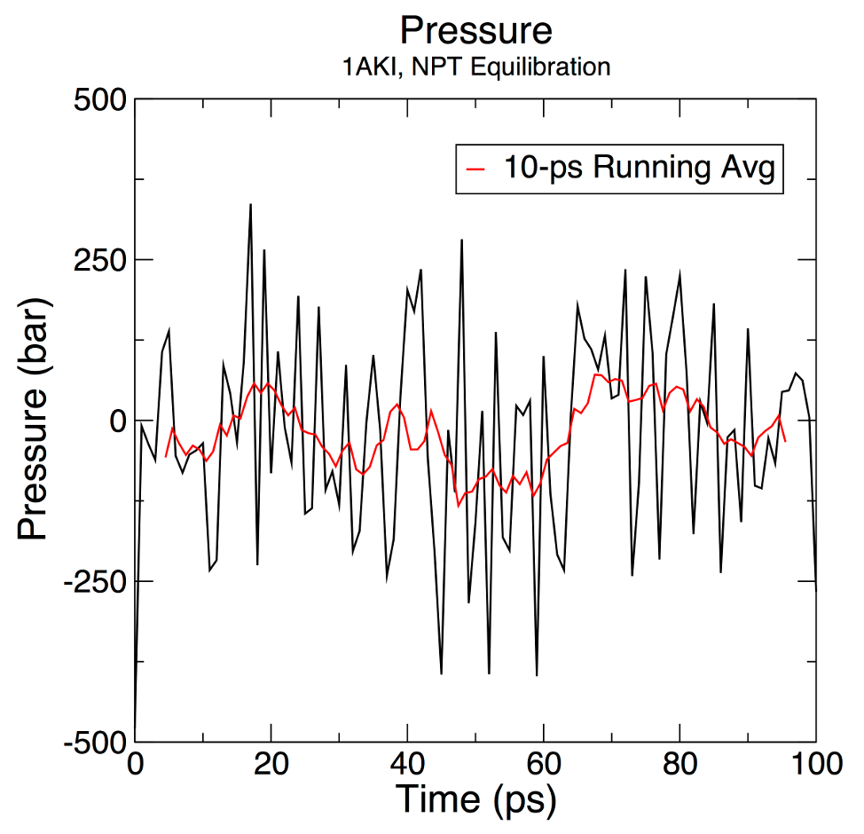
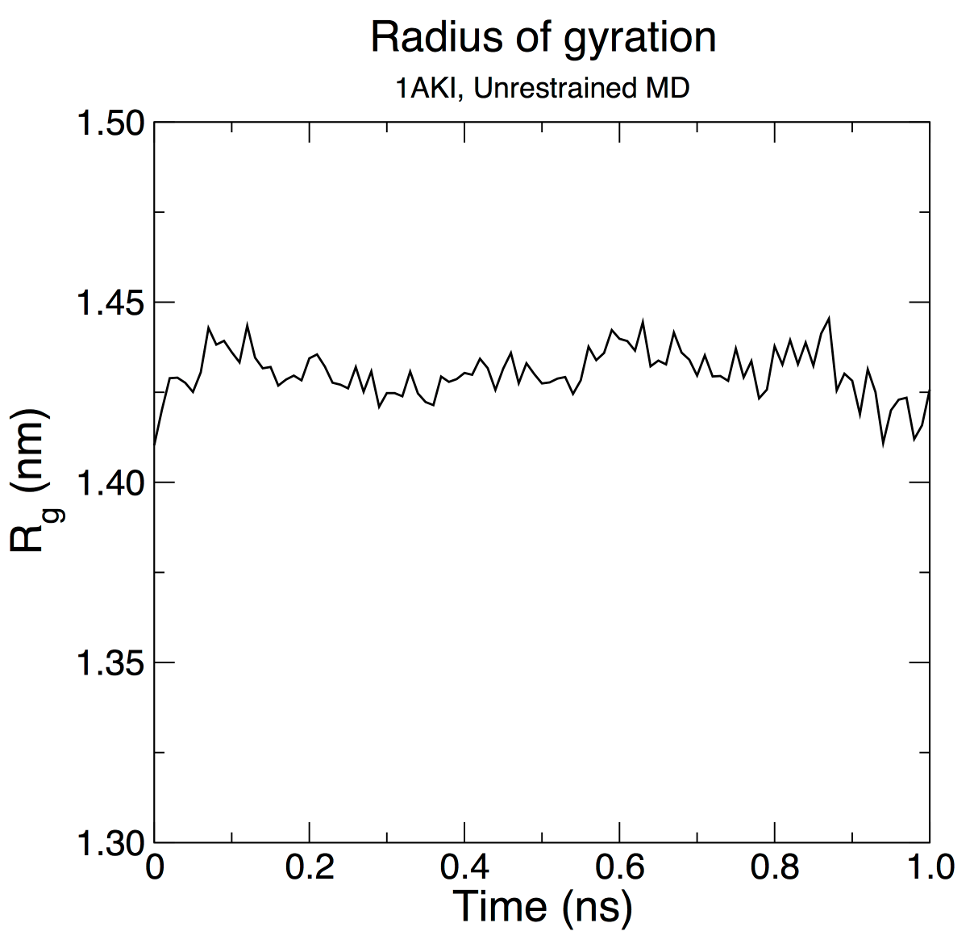

# 案例一 水中溶菌酶

这个示例将指导新用户完成设置模拟系统的过程，该系统在一盒水中含有蛋白质 （溶菌酶） 和离子。每个步骤都将包含输入和输出的说明，使用一般使用的典型设置。

整个教程的步骤如下：

## 准备拓扑文件
### PDB检索
在模拟开始前下载大分子pdb文件，通常是在[RCSB数据库官网](https://www.rcsb.org/)下载，在本教程中，我们将使用鸡蛋清溶菌酶（PDB 代码[1AKI](https://www.rcsb.org/structure/1AKI)）

下载结构后，使用 VMD、Chimera、PyMOL 等查看程序可视化结构。

### 去水
接下来要处理大分子文件，删除水分子（PDB 文件中的 `HOH`），请使用 vi、emacs （Linux/Mac） 或记事本 （Windows） 等纯文本编辑器，不要使用文字处理软件！

这里推荐统一使用VScode，配置工作路径和gmx插件后使用。

或者使用以下gmx命令：
```
grep -v HOH 1aki.pdb > 1AKI_clean.pdb
```
使用Pymol等软件去水同样可以！

并不是每次都要去水（例如有紧密结合或其他功能性活性位点水分子的情况），本案例中不需要水分子。

### 生成拓扑
现在，水分子已经去除，我们已经验证了所有必要的原子都存在，PDB文件应该只包含蛋白质原子，并准备好输入到第一个GROMACS模块`pdb2gmx`中。pdb2gmx 的目的是生成三个文件：

1. 分子的拓扑结构
2. 位置约束文件
3. 后处理的结构文件

拓扑（默认为 `topol.top`）包含在仿真中定义分子所需的所有信息。此信息包括非键合参数（原子类型和电荷）以及键合参数（键、角度和二面体）。生成拓扑后，我们将更详细地查看拓扑。

通过发出以下命令来执行 pdb2gmx：
```
gmx pdb2gmx -f 1AKI_clean.pdb -o 1AKI_processed.gro -water spce
```
该结构将由 pdb2gmx 处理，并且系统将提示您选择一个力场：
```
Select the Force Field:
From '/usr/local/gromacs/share/gromacs/top':
 1: AMBER03 protein, nucleic AMBER94 (Duan et al., J. Comp. Chem. 24, 1999-2012, 2003)
 2: AMBER94 force field (Cornell et al., JACS 117, 5179-5197, 1995)
 3: AMBER96 protein, nucleic AMBER94 (Kollman et al., Acc. Chem. Res. 29, 461-469, 1996)
 4: AMBER99 protein, nucleic AMBER94 (Wang et al., J. Comp. Chem. 21, 1049-1074, 2000)
 5: AMBER99SB protein, nucleic AMBER94 (Hornak et al., Proteins 65, 712-725, 2006)
 6: AMBER99SB-ILDN protein, nucleic AMBER94 (Lindorff-Larsen et al., Proteins 78, 1950-58, 2010)
 7: AMBERGS force field (Garcia & Sanbonmatsu, PNAS 99, 2782-2787, 2002)
 8: CHARMM27 all-atom force field (CHARM22 plus CMAP for proteins)
 9: GROMOS96 43a1 force field
10: GROMOS96 43a2 force field (improved alkane dihedrals)
11: GROMOS96 45a3 force field (Schuler JCC 2001 22 1205)
12: GROMOS96 53a5 force field (JCC 2004 vol 25 pag 1656)
13: GROMOS96 53a6 force field (JCC 2004 vol 25 pag 1656)
14: GROMOS96 54a7 force field (Eur. Biophys. J. (2011), 40,, 843-856, DOI: 10.1007/s00249-011-0700-9)
15: OPLS-AA/L all-atom force field (2001 aminoacid dihedrals)
```
`force` 字段将包含将写入拓扑的信息。您应该始终仔细阅读每个力场并确定哪个最适合您的情况。

在本教程中，我们将使用全原子`OPLS`力场，因此在命令提示符下键入`15`，然后按`Enter`。
#### 可选参数
还有许多其他选项可以传递给`pdb2gmx`这里列出了一些常用的：

-ignh：忽略 PDB 文件中的 H 原子;特别适用于核磁共振结构。否则，如果存在 H 原子，则它们必须按照 GROMACS 中的力场期望的命名方式命名。存在不同的约定，因此处理 H 原子有时会令人头疼！如果您需要保留初始 H 坐标，但需要重命名，那么 Linux sed 命令是您的好帮手。

-ter：交互式地为 N 端和 C 端分配电荷态。

-inter：交互式地为 Glu、Asp、Lys、Arg 和 His 分配电荷态；选择哪些 Cys 参与二硫键。
#### 结果分析
您现在已经生成了三个新文件：`1AKI_processed.gro`、`topol.top`和 `posre.itp`。`1AKI_processed.gro` 是一个 GROMACS 格式的结构文件，其中包含力场中定义的所有原子（即，H 原子已添加到蛋白质中的氨基酸中）。`topol.top` 文件是系统拓扑（稍后会详细介绍）。`posre.itp` 文件包含用于约束重原子位置的信息（稍后将详细介绍）。

最后一点：许多用户认为 `.gro` 文件是必需的，其实并不是。GROMACS 可以处理许多不同的文件格式，其中 `.gro` 只是写入坐标文件的命令的默认值。这是一种非常紧凑的格式，但精度有限。例如，如果您更喜欢使用 PDB 格式，您需要做的就是指定一个带有 `.pdb` 扩展名的适当文件名作为输出。pdb2gmx 的目的是生成符合力场的拓扑；`output` 结构在很大程度上是此目的的副作用，旨在方便用户。格式可以是您喜欢的任何内容。

## 检查拓扑
### topol.top
输出拓扑 `topol.top` 文件，可以使用纯文本编辑器打开。`;`符号表示为注释行。
```
#include "oplsaa.ff/forcefield.itp"
```
此行调用 OPLS-AA 力场中的参数，它位于文件的开头，表示所有后续参数都来自此力场。

下一个重要行是`[ moleculetype ]`：
```
[ moleculetype ]

; Name       nrexcl
Protein_A    3
```
名称 `Protein_A` 定义了分子名称，因为蛋白质在 PDB 文件中被标记为链 A 的事实。绑定邻域有 3 个排除项。

下一节`[ atoms ]`定义了蛋白中的氨基酸序列，信息以列的形式显示：
```
[ atoms ]
;   nr       type  resnr residue  atom   cgnr     charge       mass  typeB    chargeB      massB
; residue   1 LYS rtp LYSH q +2.0
     1   opls_287      1   LYS       N      1       -0.3    14.0067   ; qtot -0.3
     2   opls_290      1   LYS      H1      1       0.33      1.008   ; qtot 0.03
     3   opls_290      1   LYS      H2      1       0.33      1.008   ; qtot 0.36
     4   opls_290      1   LYS      H3      1       0.33      1.008   ; qtot 0.69
     5  opls_293B      1   LYS      CA      1       0.25     12.011   ; qtot 0.94
     6   opls_140      1   LYS      HA      1       0.06      1.008   ; qtot 1
```
本节信息解读如下：

- nr：原子数
- type： 原子型
- resnr：氨基酸残基数
- residue：氨基酸残基名称；请注意，此残基在 PDB 文件中为 “LYS”;使用 `.rtp` ，“LYSH”表示残基是质子化的（中性 pH 值下的主要状态）。
- atom： 原子名称
- cgnr：电荷组编号；电荷组定义整数电荷的单位，它们有助于加快计算速度
- charge： `qtot` 描述符是分子上电荷的运行总和
- mass：质量
- typeB， chargeB， massB： 用于自由能扰动（此处不讨论）

`[ bonds ]`是化学键, `[ pairs ]`原子非键合作用力, `[ angles ]`表示二键角, `[ dihedrals ]`表示二面角。

`Protein_A` 分子型定义到此结束，拓扑文件的其余部分专门用于定义其他分子并提供系统级描述，主要包括位置约束等。
```
; Include Position restraint file
#ifdef POSRES
#include "posre.itp"
#endif
```
下一个分子型（默认）是溶剂，在本例中为 SPC/E 水。其他典型的水选择包括 SPC、TIP3P 和 TIP4P。我们通过将 `-water spce` 传递给 `pdb2gmx` 来选择它。

水也可以使用 1000 kJ mol-1 nm-2 的力常数 （kpr） 进行位置约束。
```
; Include water topology
#include "oplsaa.ff/spce.itp"

#ifdef POSRES_WATER
; Position restraint for each water oxygen
[ position_restraints ]
;  i funct       fcx        fcy        fcz
   1    1       1000       1000       1000
#endif
```

接下来包括离子参数：
```
; Include generic topology for ions
#include "oplsaa.ff/ions.itp"
```
最后是系统级定义，该指令给出了在仿真期间将写入输出文件的系统的名称，该指令列出了系统中的所有分子：
```
[ system ]
; Name
LYSOZYME

[ molecules ]
; Compound        #mols
Protein_A           1
```
关于该指令的一些关键说明：

- 列出的分子的顺序必须与坐标（在本例中为 `.gro`）文件中的分子顺序完全匹配。
- 列出的名称必须与每个物种的名称相匹配，而不是残留物名称或其他任何内容。
- 如果这些具体要求没有符合条件， grompp 将会抛出致命错误，例如名称不匹配、未找到分子或许多其他错误。
### posre.itp
`posre.itp` 是位置限制文件，由 pdb2gmx 生成，它定义了一个力常数，用于在平衡过程中将原子保持在原位。

**示例**：
```
[ position_restraints ]
; atom  type      fx      fy      fz
     1     1  1000  1000  1000
     5     1  1000  1000  1000
     7     1  1000  1000  1000
    10     1  1000  1000  1000
    13     1  1000  1000  1000
```

## 定义盒子并溶剂化
这个例子中，我们将模拟一个简单的水性系统，可以在不同的溶剂中模拟蛋白质和其他分子，前提是所有相关物种都有良好的参数。
### 定义盒子
定义盒子并在其中填充溶剂有两个步骤：

1. 使用`editconf`模块定义盒子尺寸
2. 使用` solvate`模块（以前称为 genbox）将盒子装满水。

在本教程中，我们将使用一个简单的立方框作为基本单元，随着您对周期性边界条件和框类型越来越熟悉，可以使用菱形十二面体，因为它的体积是相同周期距离的立方框的 ~71%，从而节省了需要添加以溶解蛋白质的水分子数量。

让我们用`editconf`定义这个盒子：
```
gmx editconf -f 1AKI_processed.gro -o 1AKI_newbox.gro -c -d 1.0 -bt cubic
```
上述命令将蛋白质在框 （-c） 中居中，并将其放置在距框边缘至少 1.0 nm （-d 1.0） 的位置。框类型定义为多维数据集 （-bt cubic）。到框边缘的距离是一个重要参数。由于我们将使用周期性边界条件，因此必须满足最小图像约定。也就是说，蛋白质永远不应该看到它的周期性图像，否则计算的力将是虚假的。指定 1.0 nm 的溶质盒距离意味着蛋白质的任意两个周期性图像之间至少有 2.0 nm。这个距离对于模拟中常用的几乎任何截止方案都足够了。
### 溶剂化
现在我们已经定义了一个盒子，我们可以用溶剂（水）填充它。溶剂化是使用溶剂化物完成的：
```
gmx solvate -cp 1AKI_newbox.gro -cs spc216.gro -o 1AKI_solv.gro -p topol.top
```
蛋白质的配置 （-cp） 包含在上一个`editconf`步骤的输出中，溶剂的配置 （-cs） 是标准 GROMACS 安装的一部分。我们使用的是`spc216.gro`，这是一个通用的平衡 3 点溶剂模型。您可以使用`spc216.gro`作为 SPC、SPC/E 或 TIP3P 水的溶剂配置，因为它们都是三点水模型。输出名为`1AKI_solv.gro`，我们告诉`solvate`拓扑文件的名称 （`topol.top`） 以便对其进行修改。

请注意对 `topol.top` 指令的更改：
```
[ molecules ]
; Compound  #mols
Protein_A       1 
SOL         10832 
```
`solvate`所做的是跟踪它添加了多少水分子，然后将其写入您的拓扑以反映所做的更改。请注意，如果您使用任何其他（非水）溶剂，`solvate`不会对您的拓扑进行这些更改！它与更新水分子的兼容性是硬编码的。

## 添加离子

我们现在有一个包含带电蛋白质的溶剂化系统。pdb2gmx 的输出告诉我们，该蛋白质的净电荷为 +8e（基于其氨基酸组成）。如果您在 pdb2gmx 输出中错过了此信息，查看 `topol.top` 中指令的最后一行；它应该读作（部分）“QTOT 8”。由于生命不以净电荷存在，因此我们必须将离子添加到我们的系统中。

在 GROMACS 中添加离子的工具称为`genion`。它可以读取拓扑结构，并用用户指定的离子替换水分子。该输入称为运行输入文件，其扩展名为 `.tpr`；此文件由 GROMACS `grompp` 模块 （GROMACS pre-processor） 生成，稍后在运行第一次模拟时也将使用该文件。
`grompp` 所做的是处理坐标文件和拓扑（描述分子）以生成原子级输入 `.tpr`。`.tpr` 文件包含系统中所有原子的所有参数。

### 构建mdp文件

构建下列`ions.mdp`文件：
```
; ions.mdp - used as input into grompp to generate ions.tpr
; Parameters describing what to do, when to stop and what to save
integrator  = steep         ; Algorithm (steep = steepest descent minimization)
emtol       = 1000.0        ; Stop minimization when the maximum force < 1000.0 kJ/mol/nm
emstep      = 0.01          ; Minimization step size
nsteps      = 50000         ; Maximum number of (minimization) steps to perform

; Parameters describing how to find the neighbors of each atom and how to calculate the interactions
nstlist         = 1         ; Frequency to update the neighbor list and long range forces
cutoff-scheme	= Verlet    ; Buffered neighbor searching 
ns_type         = grid      ; Method to determine neighbor list (simple, grid)
coulombtype     = cutoff    ; Treatment of long range electrostatic interactions
rcoulomb        = 1.0       ; Short-range electrostatic cut-off
rvdw            = 1.0       ; Short-range Van der Waals cut-off
pbc             = xyz       ; Periodic Boundary Conditions in all 3 dimensions
```

### 构建tpr文件
要生成带有 grompp 的 `.tpr` 文件，我们需要一个扩展名为 `.mdp` 的额外输入文件;`Grompp` 会将 `.mdp` 文件中指定的参数与坐标和拓扑信息进行组合，以生成 `.tpr` 文件。

`.mdp` 文件通常用于运行能量最小化或 MD 模拟，但在这种情况下，它仅用于生成系统的原子描述。可以在此处下载示例 `.mdp` 文件（我们将使用的那个）。

实际上，此步骤中使用的 `.mdp` 文件可以包含任何合法的参数组合。我通常使用能量最小化脚本，因为它们非常基本，不涉及任何复杂的参数组合。请注意，本教程提供的文件仅用于 `OPLS-AA` 力场。其他力场的设置（尤其是非接合交互设置）将有所不同。


将 `.tpr` 文件与以下内容组合在一起：
```
gmx grompp -f ions.mdp -c 1AKI_solv.gro -p topol.top -o ions.tpr
```
现在我们在二进制文件 ions.tpr 中对系统进行了原子级描述。我们将此文件传递给 genion：
```
gmx genion -s ions.tpr -o 1AKI_solv_ions.gro -p topol.top -pname NA -nname CL -neutral
```
出现提示时，选择第 13 组 “SOL” 进行嵌入离子，不用离子替换蛋白质的某些部分。

在 genion 命令中，我们提供结构/状态文件 （-s） 作为输入，生成一个 `.gro` 文件作为输出 （-o），处理拓扑 （-p） 以反映水分子的去除和离子的添加，定义正离子和负离子名称（分别为 -pname 和 -nname），并告诉 `genion` 通过添加正确数量的负离子（-neutral、 在这种情况下，将添加 8 个 Cl- 离子以抵消蛋白质上的 +8 电荷）。除了通过同时指定 `-neutral` 和 `-conc` 选项来中和系统之外，您还可以使用 `genion` 添加指定浓度的离子。

在 GROMACS 的早期版本中，使用 `-pname` 和 `-nname` 指定的离子名称是力场特定的，但在 4.5 版中是标准化的。指定的离子名称始终是所有大写字母的元素符号，这是随后写入拓扑的名称。残基或原子名称可能会也可能不会附加电荷的符号 （+/-），具体取决于力场。请勿在 genion 命令中使用 `atom` 或 `residue` 名称，否则在后续步骤中会遇到错误。

此时的`topol.top`文件`[ molecules ]`应如下所示：
```
[ molecules ]
; Compound      #mols
Protein_A         1
SOL           10636
CL                8
```

此时的`1AKI_solv_ions.gro`文件如下：


## 能量最小化

溶剂化的电中性系统现已组装完成，在开始动力学之前，我们必须确保系统没有空间冲突或不适当的几何图形。该结构通过称为能量最小化 （EM） 的过程而松弛。

EM 的过程很像离子的添加。我们将再次使用 grompp 将结构、拓扑和仿真参数组装成二进制输入文件 （`.tpr`），但这一次，我们将通过 GROMACS MD 引擎 `mdrun` 运行能量最小化，而不是将 `.tpr` 传递给 genion。

### 构建mdp文件
新建以下内容的minim.mdp文件：

```
; minim.mdp - used as input into grompp to generate em.tpr
; Parameters describing what to do, when to stop and what to save
integrator  = steep         ; Algorithm (steep = steepest descent minimization)
emtol       = 1000.0        ; Stop minimization when the maximum force < 1000.0 kJ/mol/nm
emstep      = 0.01          ; Minimization step size
nsteps      = 50000         ; Maximum number of (minimization) steps to perform

; Parameters describing how to find the neighbors of each atom and how to calculate the interactions
nstlist         = 1         ; Frequency to update the neighbor list and long range forces
cutoff-scheme   = Verlet    ; Buffered neighbor searching
ns_type         = grid      ; Method to determine neighbor list (simple, grid)
coulombtype     = PME       ; Treatment of long range electrostatic interactions
rcoulomb        = 1.0       ; Short-range electrostatic cut-off
rvdw            = 1.0       ; Short-range Van der Waals cut-off
pbc             = xyz       ; Periodic Boundary Conditions in all 3 dimensions
```

使用以下输入参数文件通过 `grompp` 组装二进制输入：
```
gmx grompp -f minim.mdp -c 1AKI_solv_ions.gro -p topol.top -o em.tpr
```
确保在运行 `genbox` 和 genion 时一直在更新 `topol.top` 文件，否则您将收到许多令人讨厌的错误消息（“坐标文件中的坐标数量与拓扑不匹配”等）。

### 执行能量最小化

现在，我们已准备好调用 `mdrun` 来执行 EM：
```
gmx mdrun -v -deffnm em
```
-v 字符可以输出 `mdrun` 的每一步都进度，-deffnm 为将定义输入和输出的文件名。因此，如果您没有将 grompp 输出命名为 “`em.tpr`”，则必须使用 mdrun -s 标志显式指定其名称。在我们的例子中，我们将得到以下文件：

- em.log：EM 进程的 ASCII 文本日志文件
- em.edr：二进制能量文件
- em.trr：二进制全精度轨迹
- em.gro：能量最小化结构

### 检验结果

要确定 EM 是否成功，需要评估两个非常重要的因素。第一个是势能（在 EM 过程结束时打印，即使没有 -v）。Epot 应为负数，并且（对于水中的简单蛋白质）约为 10 5-106，具体取决于系统大小和水分子的数量。第二个重要特征是最大力 Fmax，其目标在 minim.mdp 中设置 - “emtol = 1000.0” - 表示目标 Fmax 不大于 1000 kJ mol-1 nm-1。有可能得出一个合理的 E锅，其中 Fmax > emtol。如果发生这种情况，您的系统可能不够稳定，无法进行仿真。评估它可能发生的原因，并可能更改您的最小化参数（积分器、emstep 等）。

我们来做一些分析。`em.edr` 文件包含 GROMACS 在 EM 期间收集的所有能量项。您可以使用 GROMACS 能量模块分析任何 `.edr` 文件：
```
gmx energy -f em.edr -o potential.xvg
```
在提示符下，键入 “10 0” 以选择 Potential （10）；0 终止输入。您将看到 Epot 的平均值，并且将写入一个名为 `potential.xvg` 的文件。要绘制此数据，需要 Xmgrace 绘图工具。生成的图应该看起来像这样，展示了 Epot 的良好、稳定的收敛：


现在我们的系统处于能量最低水平，随后开始动力学模拟部分。

## 平衡

EM 确保我们在几何形状和溶剂取向方面具有合理的起始结构。要开始真正的动力学，我们必须平衡蛋白质周围的溶剂和离子。如果我们在这一点上尝试无拘无束的动态，系统可能会崩溃。原因是溶剂大部分内部都是优化的，而不一定是溶质的优化。需要将其加热到我们希望模拟的温度，并建立有关溶质（蛋白质）的正确方向。在我们达到正确的温度（基于动能）后，我们将对系统施加压力，直到它达到适当的密度。

还记得很久以前 pdb2gmx 生成的那个 `posre.itp` 文件吗？我们现在就使用它。`posre.itp` 的目的是对蛋白质的重原子（任何不是氢的东西）施加位置应变力。允许移动，但前提是克服了大量的能量损失。位置约束的实用性在于，它们允许我们平衡蛋白质周围的溶剂，而不会增加蛋白质结构变化的变量。位置约束的原点 （约束电位为零的坐标） 通过传递给 grompp 的 -r 选项的坐标文件提供。

平衡通常分两个阶段进行。第一阶段在 NVT 系综（恒定的粒子数、体积和温度）下进行。这个系综也被称为 “isothermal -isochoric” 或 “canonical”。这种程序的时间框架取决于系统的内容，但在 NVT 中，系统的温度应该达到所需值的平台。如果温度尚未稳定，则需要额外的时间。通常，50-100 ps 就足够了，我们将为这个练习进行 100 ps 的 NVT 平衡。根据您的机器，这可能需要一段时间（如果在 16 个内核左右并行运行，则不到一个小时）。

### 温度平衡 NVT

#### 构建mdp文件

构建下列`nvt.mdp`文件：
```
title                   = OPLS Lysozyme NVT equilibration 
define                  = -DPOSRES  ; position restrain the protein
; Run parameters
integrator              = md        ; leap-frog integrator
nsteps                  = 50000     ; 2 * 50000 = 100 ps
dt                      = 0.002     ; 2 fs
; Output control
nstxout                 = 500       ; save coordinates every 1.0 ps
nstvout                 = 500       ; save velocities every 1.0 ps
nstenergy               = 500       ; save energies every 1.0 ps
nstlog                  = 500       ; update log file every 1.0 ps
; Bond parameters
continuation            = no        ; first dynamics run
constraint_algorithm    = lincs     ; holonomic constraints 
constraints             = h-bonds   ; bonds involving H are constrained
lincs_iter              = 1         ; accuracy of LINCS
lincs_order             = 4         ; also related to accuracy
; Nonbonded settings 
cutoff-scheme           = Verlet    ; Buffered neighbor searching
ns_type                 = grid      ; search neighboring grid cells
nstlist                 = 10        ; 20 fs, largely irrelevant with Verlet
rcoulomb                = 1.0       ; short-range electrostatic cutoff (in nm)
rvdw                    = 1.0       ; short-range van der Waals cutoff (in nm)
DispCorr                = EnerPres  ; account for cut-off vdW scheme
; Electrostatics
coulombtype             = PME       ; Particle Mesh Ewald for long-range electrostatics
pme_order               = 4         ; cubic interpolation
fourierspacing          = 0.16      ; grid spacing for FFT
; Temperature coupling is on
tcoupl                  = V-rescale             ; modified Berendsen thermostat
tc-grps                 = Protein Non-Protein   ; two coupling groups - more accurate
tau_t                   = 0.1     0.1           ; time constant, in ps
ref_t                   = 300     300           ; reference temperature, one for each group, in K
; Pressure coupling is off
pcoupl                  = no        ; no pressure coupling in NVT
; Periodic boundary conditions
pbc                     = xyz       ; 3-D PBC
; Velocity generation
gen_vel                 = yes       ; assign velocities from Maxwell distribution
gen_temp                = 300       ; temperature for Maxwell distribution
gen_seed                = -1        ; generate a random seed
```
 `.mdp` 文件中的几个主要的参数：

- gen_vel = yes：启动速度生成。使用不同的随机种子 （gen_seed） 会得到不同的初始速度，因此可以从相同的起始结构进行多个（不同的）仿真。
- tcoupl = V-rescale：速度重新定标恒温器是对 Berendsen 弱耦合方法的改进，该方法没有再现正确的动力学系综。
pcoupl = no：不应用压力耦合。


#### 开启NVT
我们将调用 grompp 和 mdrun，就像我们在 EM 步骤中所做的那样：
```
gmx grompp -f nvt.mdp -c em.gro -r em.gro -p topol.top -o nvt.tpr

gmx mdrun -deffnm nvt
```

#### 分析温度变化

使用下列命令绘图：
```
gmx energy -f nvt.edr -o temperature.xvg
```
在提示符下键入“16 0”以选择系统的温度并退出。生成的绘图应如下所示：


从图中可以清楚地看出，系统的温度很快达到目标值 （300 K），并且在平衡的剩余时间内保持稳定。对于该系统，较短的平衡期（大约 50 ps）可能就足够了。

### 压力平衡 NPT
上一步 NVT 平衡稳定了系统的温度，下一步开始稳定系统的压力（以及密度）。压力平衡在 NPT 系综下进行，其中粒子数、压力和温度都是恒定的。该系差也称为“等温-等压”系差，与实验条件最相似。


#### 构建mdp文件
构建下列内容的用于 100 ps NPT 平衡的 `.mdp` 文件：
```
title                   = OPLS Lysozyme NPT equilibration 
define                  = -DPOSRES  ; position restrain the protein
; Run parameters
integrator              = md        ; leap-frog integrator
nsteps                  = 50000     ; 2 * 50000 = 100 ps
dt                      = 0.002     ; 2 fs
; Output control
nstxout                 = 500       ; save coordinates every 1.0 ps
nstvout                 = 500       ; save velocities every 1.0 ps
nstenergy               = 500       ; save energies every 1.0 ps
nstlog                  = 500       ; update log file every 1.0 ps
; Bond parameters
continuation            = yes       ; Restarting after NVT 
constraint_algorithm    = lincs     ; holonomic constraints 
constraints             = h-bonds   ; bonds involving H are constrained
lincs_iter              = 1         ; accuracy of LINCS
lincs_order             = 4         ; also related to accuracy
; Nonbonded settings 
cutoff-scheme           = Verlet    ; Buffered neighbor searching
ns_type                 = grid      ; search neighboring grid cells
nstlist                 = 10        ; 20 fs, largely irrelevant with Verlet scheme
rcoulomb                = 1.0       ; short-range electrostatic cutoff (in nm)
rvdw                    = 1.0       ; short-range van der Waals cutoff (in nm)
DispCorr                = EnerPres  ; account for cut-off vdW scheme
; Electrostatics
coulombtype             = PME       ; Particle Mesh Ewald for long-range electrostatics
pme_order               = 4         ; cubic interpolation
fourierspacing          = 0.16      ; grid spacing for FFT
; Temperature coupling is on
tcoupl                  = V-rescale             ; modified Berendsen thermostat
tc-grps                 = Protein Non-Protein   ; two coupling groups - more accurate
tau_t                   = 0.1     0.1           ; time constant, in ps
ref_t                   = 300     300           ; reference temperature, one for each group, in K
; Pressure coupling is on
pcoupl                  = Parrinello-Rahman     ; Pressure coupling on in NPT
pcoupltype              = isotropic             ; uniform scaling of box vectors
tau_p                   = 2.0                   ; time constant, in ps
ref_p                   = 1.0                   ; reference pressure, in bar
compressibility         = 4.5e-5                ; isothermal compressibility of water, bar^-1
refcoord_scaling        = com
; Periodic boundary conditions
pbc                     = xyz       ; 3-D PBC
; Velocity generation
gen_vel                 = no        ; Velocity generation is off 
```
它与用于 NVT 平衡的参数文件没有太大区别，使用 `Parrinello-Rahman` 恒压器添加了压力耦合部分，其他一些更改如下：

- continuation = yes：我们从 NVT 平衡阶段继续模拟
- gen_vel = no：从轨迹中读取速度（见下文）

#### 开启NPT

随后继续调用 grompp 和 mdrun，和NVT相同。请注意，我们现在包括 -t 标志以包含 NVT 平衡的检查点文件;此文件包含继续模拟所需的所有状态变量。为了守恒 NVT 期间产生的速度，我们必须包含此文件。坐标文件 （-c） 是 NVT 仿真的最终输出。
```
gmx grompp -f npt.mdp -c nvt.gro -r nvt.gro -t nvt.cpt -p topol.top -o npt.tpr

gmx mdrun -deffnm npt
```

#### 分析结果
先使用`energy`来分析压力级数：
```
gmx energy -f npt.edr -o pressure.xvg
```
在提示符处键入 “18 0” 以选择系统的压力并退出。生成的绘图应如下所示：


压力值在 100 ps 平衡阶段波动很大，但这种行为并不意外。这些数据的运行平均值在图中绘制为红线。在平衡过程中，压力的平均值为 7.5 ± 160.5 bar。请注意，参考压力设置为 1 bar，那么这个结果是否可以接受？压力是在 MD 模拟过程中波动很大的量，从较大的均方根波动 （160.5 bar） 中可以清楚地看出，因此从统计学上讲，无法区分获得的平均值（7.5 ± 160.5 bar）和目标/参考值（1 bar）之间的差异。

再分析密度，这次使用`energy`并在提示符处输入 “24 0”。
```
gmx energy -f npt.edr -o density.xvg
```
与压力一样，密度的运行平均值也用红色绘制。100 ps 过程中的平均值为 1019 ± 3 kg m-3，接近 1000 kg m-3 的实验值和 SPC/E 模型的预期密度 1008 kg m-3。SPC/E 水模型的参数与水的实验值非常相似。密度值随着时间的推移非常稳定，表明系统现在在压力和密度方面得到了很好的平衡。


如果获得的密度值与该结果不匹配，可能是因为与压力相关的项收敛速度较慢，因此可能需要运行 NPT 平衡的时间略长于此处指定的时间。

## 开始模拟

完成两个平衡阶段后，系统现在在所需的温度和压力下得到很好的平衡。现在，我们已准备好释放位置约束并运行生产 MD 进行数据收集。这个过程就像我们之前看到的一样，因为我们将使用 checkpoint 文件（在本例中现在包含 preserve 压力耦合信息）到 grompp。我们将运行 1 ns 的 MD 仿真。

### mdp文件

构建下列的`md.mdp`配置文件：
```
title                   = OPLS Lysozyme NPT equilibration 
; Run parameters
integrator              = md        ; leap-frog integrator
nsteps                  = 500000    ; 2 * 500000 = 1000 ps (1 ns)
dt                      = 0.002     ; 2 fs
; Output control
nstxout                 = 0         ; suppress bulky .trr file by specifying 
nstvout                 = 0         ; 0 for output frequency of nstxout,
nstfout                 = 0         ; nstvout, and nstfout
nstenergy               = 5000      ; save energies every 10.0 ps
nstlog                  = 5000      ; update log file every 10.0 ps
nstxout-compressed      = 5000      ; save compressed coordinates every 10.0 ps
compressed-x-grps       = System    ; save the whole system
; Bond parameters
continuation            = yes       ; Restarting after NPT 
constraint_algorithm    = lincs     ; holonomic constraints 
constraints             = h-bonds   ; bonds involving H are constrained
lincs_iter              = 1         ; accuracy of LINCS
lincs_order             = 4         ; also related to accuracy
; Neighborsearching
cutoff-scheme           = Verlet    ; Buffered neighbor searching
ns_type                 = grid      ; search neighboring grid cells
nstlist                 = 10        ; 20 fs, largely irrelevant with Verlet scheme
rcoulomb                = 1.0       ; short-range electrostatic cutoff (in nm)
rvdw                    = 1.0       ; short-range van der Waals cutoff (in nm)
; Electrostatics
coulombtype             = PME       ; Particle Mesh Ewald for long-range electrostatics
pme_order               = 4         ; cubic interpolation
fourierspacing          = 0.16      ; grid spacing for FFT
; Temperature coupling is on
tcoupl                  = V-rescale             ; modified Berendsen thermostat
tc-grps                 = Protein Non-Protein   ; two coupling groups - more accurate
tau_t                   = 0.1     0.1           ; time constant, in ps
ref_t                   = 300     300           ; reference temperature, one for each group, in K
; Pressure coupling is on
pcoupl                  = Parrinello-Rahman     ; Pressure coupling on in NPT
pcoupltype              = isotropic             ; uniform scaling of box vectors
tau_p                   = 2.0                   ; time constant, in ps
ref_p                   = 1.0                   ; reference pressure, in bar
compressibility         = 4.5e-5                ; isothermal compressibility of water, bar^-1
; Periodic boundary conditions
pbc                     = xyz       ; 3-D PBC
; Dispersion correction
DispCorr                = EnerPres  ; account for cut-off vdW scheme
; Velocity generation
gen_vel                 = no        ; Velocity generation is off 
```

### 执行MD模拟
下列命令可以将模拟参数、初始结构、拓扑信息和检查点文件整合成一个二进制文件（.tpr 文件），供后续的分子动力学模拟使用：
```
gmx grompp -f md.mdp -c npt.gro -t npt.cpt -p topol.top -o md_0_1.tpr
```
grompp 将打印 PME 负载的估计值，这将决定应该有多少个处理器专用于 PME 计算，以及有多少个处理器用于 PP 计算。

对于立方体盒子，最佳设置的PME负载为0.25（3:1 PP:PME）；对于十二面体箱，最佳PME载荷为0.33（2:1 PP:PME）。

执行mdrun时，程序应自动确定为PP和PME计算分配的最佳处理器数量。因此，请确保为计算指定适当数量的线程/内核（-nt X的值），以便获得最佳性能。

执行 `mdrun`：
```
gmx mdrun -deffnm md_0_1 -v
```
使用`-v`命令会显示每一步的具体进度

```
gmx mdrun -deffnm md_0_1 -v -cpi md_0_1.cpt 12000
```
.cpt 文件包含前一阶段模拟的状态信息（如速度、能量等），用于从断点继续模拟，使用`-cpi`命令，可以从第12000步重新接续计算。

### GPU加速
在 GROMACS 2018 中，可以将 PME 计算卸载到图形处理单元 （GPU） 中，从而大大加快仿真速度。使用 Titan Xp GPU，该系统可以以惊人的 295 ns/天的速度进行模拟！

假设您有一个可用的 GPU，使用它的 mdrun 命令非常简单：
```
gmx mdrun -deffnm md_0_1 -nb gpu
```


## 结果分析

现在我们已经模拟了蛋白质，我们应该对系统进行一些分析。在本教程中，将介绍一些基本动力学模拟的数据分析工具。
### trjconv校正
`trjconv` 用作后处理工具，用于去除坐标、校正周期性或手动更改轨迹（时间单位、帧频率等）。我们使用 `trjconv` 来考虑系统中的任何周期性，蛋白质将通过晶胞扩散，并且可能看起来“破碎”或可能“跳”到盒子的另一侧。要考虑此类行为，请发出以下内容：

```
gmx trjconv -s md_0_1.tpr -f md_0_1.xtc -o md_0_1_noPBC.xtc -pbc mol -center
```

选择 1 （“Protein”） 作为要居中的组，选择 0 （“System”） 作为输出。我们将根据这个 “修正” 的轨迹进行所有分析。让我们先看看结构稳定性。
### RMSD
GROMACS 有一个用于 RMSD 计算的内置实用程序，称为` rms`，使用以下命令：

```
gmx rms -s md_0_1.tpr -f md_0_1_noPBC.xtc -o rmsd.xvg -tu ns
```

选择 4（“Backbone”）作为最小二乘拟合和 RMSD 计算的组。-tu 标志将以 ns 为单位输出结果，即使轨迹以 ps 为单位编写。这样做是为了使输出清晰（特别是如果你有一个长时间的模拟 - 1e+05 ps 看起来不如 100 ns）。

使用下列命令来计算相对于晶体结构的 RMSD：
```
gmx rms -s em.tpr -f md_0_1_noPBC.xtc -o rmsd_xtal.xvg -tu ns
```
将两个结果一起绘制，结果如下所示：


两个时间序列都显示 RMSD 水平低至 ~0.1 nm （1 Å），表明结构非常稳定。图之间的细微差异表明，t = 0 ns 处的结构与这种晶体结构略有不同。这是意料之中的，因为它已经被能量最小化，而且如前所述，位置约束并不是 100% 完美的。

### 回转半径
蛋白质的回转半径是其紧凑性的量度。如果蛋白质稳定折叠，它可能会保持相对稳定的 Rg 值。如果蛋白质去折叠，它的 Rg 会随着时间的推移而变化。让我们在模拟中分析溶菌酶的回转半径：
```
gmx gyrate -s md_0_1.tpr -f md_0_1_noPBC.xtc -o gyrate.xvg
```
选择第 1 组 （Protein） 进行分析：


从合理不变的 Rg 值中可以看出，蛋白质在 300 K 下以紧凑（折叠）形式在 1 ns 的过程中保持非常稳定。

## 总结
现在，您已经使用 GROMACS 进行了分子动力学模拟，并分析了一些结果。不应将本教程视为全面。使用 GROMACS 可以进行更多类型的模拟（自由能计算、非平衡 MD 和正则模态分析，仅举几例）。您还应该查看文献和 GROMACS 手册，以调整此处提供的`.mdp`文件，以提高效率和准确性。