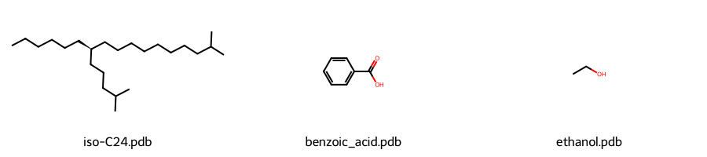
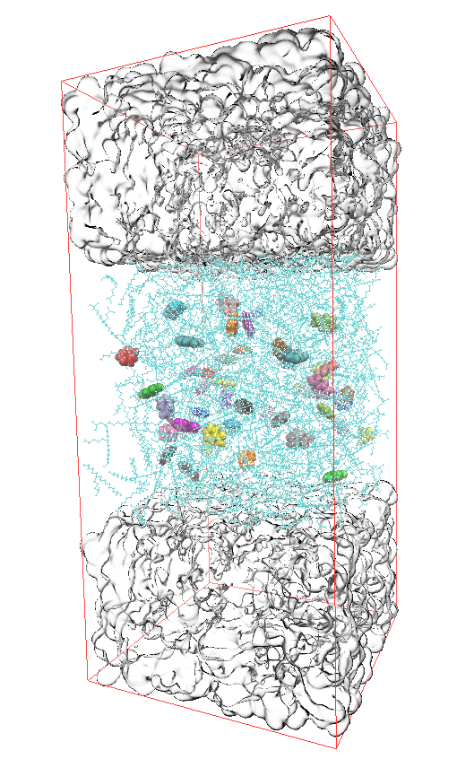

# 案例四 乙醇萃取矿物油中苯甲酸

本节案例我们将实现双相体系模拟，构建乙醇-矿物油双相体系，模拟乙醇萃取油中苯甲酸，模拟结果将观察到苯甲酸分子从油相逐步迁移进入乙醇相。本案例的相关文件在此链接。

## 分子建模

使用如下smiles式构建矿物油、苯甲酸和乙醇分子，经构象优化后得到三维结构的pdb文件（也可以直接从PubChem中下载）：
```
CCCCCC[C@@H](CCCCCCCCC(C)C)CCCC(C)C
OC(=O)c1ccccc1
CCO
```



编写以下`config.inp`文件，作为packmol的输入

```bash
tolerance 2.0
filetype pdb
output system.pdb

structure iso-C24.pdb
  number 400
  inside box 0 0 50 80 80 130
end structure

structure benzoic_acid.pdb
  number 50
  inside box 0 0 60 80 80 120
end structure

structure ethanol.pdb
  number 3000
  inside box 0 0 0 80 80 50
end structure

structure ethanol.pdb
  number 3000
  inside box 0 0 130 80 80 180
end structure
```

执行以下命令使用packmol构建复合体系：

```bash
packmol -i config.inp
```

设置体系盒子：

```
gmx editconf -f system.pdb -o system_box -box 8 8 18
```

得到`system_box.gro`文件，使用VMD查看构建成功的双相体系，上下两层乙醇相，中间为油相，其中参杂着苯甲酸分子。

VMD中设置盒子框线的命令如下：
```
pbc box -color red -width 1
```



## 构建拓扑

本次模拟是液体体系，适合使用OPLSAA力场，对于该力场的构建需要使用LigParGen网站，[链接在此](https://zarbi.chem.yale.edu/ligpargen/)。

在此网站上下载oplsaam.ff力场压缩包，解压到工作目录下；上传我们的三个小分子，在线构建力场，得到对应的itp文件：

```bash
dir/
├── oplsaam.ff/
├── benzoic_acid.itp
├── iso-C24.itp
└── ethanol.itp
```

构建如下的`topol.top`文件，引入**oplsaam.ff**力场文件、水分子力场文件、三种小分子的`itp`文件，`[ System ]`内容可以随意设置，`[ Molecules ]`块中依次写入各组分名称和数目，注意这里要和构建的体系分子数完全一致。

```
#include "./oplsaam.ff/forcefield.itp"
#include "./oplsaam.ff/spce.itp"

#include "benzoic_acid.itp"         // [!code warning]
#include "iso-C24.itp"              // [!code warning]
#include "ethanol.itp"              // [!code warning]

[ System ]
Extraction of Benzoic Acid

[ Molecules ]
isoC24   400
ARO       50
ETH     6000
```


## 能量最小化

构建如下`em.mdp`文件：
```
integrator               = steep
nsteps                   = 50000

nstenergy                = 500
nstlog                   = 500

define                   = -DFLEXIBLE

cutoff-scheme            = Verlet

coulombtype              = PME
rcoulomb                 = 1.0

vdwtype                  = Cut-off
rvdw                     = 1.0
DispCorr                 = EnerPres
```

构建能量最小化的tpr文件：
```
gmx grompp -f em -o em -c system_box
```

执行能量最小化：
```
gmx mdrun -deffnm em -v
```

```
writing lowest energy coordinates.

Steepest Descents did not converge to Fmax < 10 in 50001 steps.
Potential Energy  = -2.3867853e+05
Maximum force     =  3.2427014e+02 on atom 29906
Norm of force     =  2.6459311e+00

GROMACS reminds you: "It's So Fast It's Slow" (F. Black)
```

## 平衡体系

构建如下`npt.mdp`文件：
```
integrator               = md
dt                       = 0.002
nsteps                   = 150000    ; 300 ps

nstenergy                = 1000
nstlog                   = 5000
nstxout                  = 0
nstxout-compressed       = 1000

constraints              = h-bonds

cutoff-scheme            = Verlet
coulombtype              = PME
rcoulomb                 = 1.0
vdwtype                  = Cut-off
rvdw                     = 1.0
DispCorr                 = EnerPres

; 控温 - 删除退火
tcoupl                   = v-rescale
tc-grps                  = System
tau_t                    = 0.2
ref_t                    = 323.15

; 控压 - 平衡阶段可以使用 Berendsen
pcoupl                   = Berendsen
pcoupltype               = isotropic
tau_p                    = 2.0
compressibility          = 4.46e-5
ref_p                    = 1.01325

gen_vel                  = yes
gen_temp                 = 323.15
gen_seed                 = -1
```

构建npt平衡的tpr文件：
```
gmx grompp -f npt -o npt -c em
```
开始npt平衡：
```
gmx mdrun -deffnm npt -v
```

查看平衡过程的体系密度：
```
echo "Density" | gmx energy -f npt.edr -o density.xvg
```

查看平衡过程的体系温度：
```
echo "Temperature" | gmx energy -f npt.edr -o temperature.xvg
```

查看平衡过程的体系压力：
```
echo "Pressure" | gmx energy -f npt.edr -o pressure.xvg
```


## 开始模拟

编写如下`md.mdp`文件：

```
integrator               = md
dt                       = 0.002
nsteps                   = 15000000  ; 30 ns

nstenergy                = 5000
nstlog                   = 5000
nstxout-compressed       = 5000

continuation             = yes       ; 从NPT平衡继续
constraints              = h-bonds

cutoff-scheme            = Verlet
coulombtype              = PME
rcoulomb                 = 1.0
vdwtype                  = Cut-off
rvdw                     = 1.0
DispCorr                 = EnerPres

; 控温
tcoupl                   = v-rescale
tc-grps                  = System
tau_t                    = 0.2
ref_t                    = 323.15

; 控压
pcoupl                   = Parrinello-Rahman
pcoupltype               = isotropic
tau_p                    = 2.0
compressibility          = 4.46e-5
ref_p                    = 1.01325

gen_vel                  = no
```

构建成品模拟的tpr文件：
```
gmx grompp -f md.mdp -c npt.gro -t npt.cpt -p topol.top -o md.tpr
```

开始模拟：
```
gmx mdrun -s md.tpr -deffnm md -v
```

断点续跑命令：
```
gmx mdrun -deffnm md -cpi md.cpt -v
```

## 结果分析

### 轨迹居中

```
gmx trjconv -s md.tpr -f md.xtc -o md_center.xtc -pbc mol -center
```

### 可视化


### 定性分析