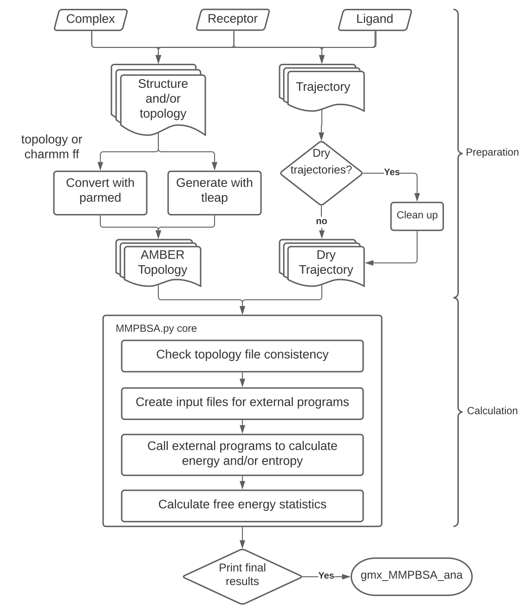

# gmx_MMPBSA

点击查看：[官方文档](https://valdes-tresanco-ms.github.io/gmx_MMPBSA/dev/)

`gmx_MMPBSA` 是一种基于 `AMBER MMPBSA.py` 的新工具，旨在使用 GROMACS 文件执行最终状态自由能计算。

gmx_MMPBSA可以执行多项计算，例如：
- 将自由能计算与 PB、GB 和/或 3D-RISM 模型绑定
- 丙氨酸扫描
- 结合自由能分解
- 熵校正（IE、C2、NMODE）
- 稳定性
- QM/MMGBSA

的工作流程如下：
