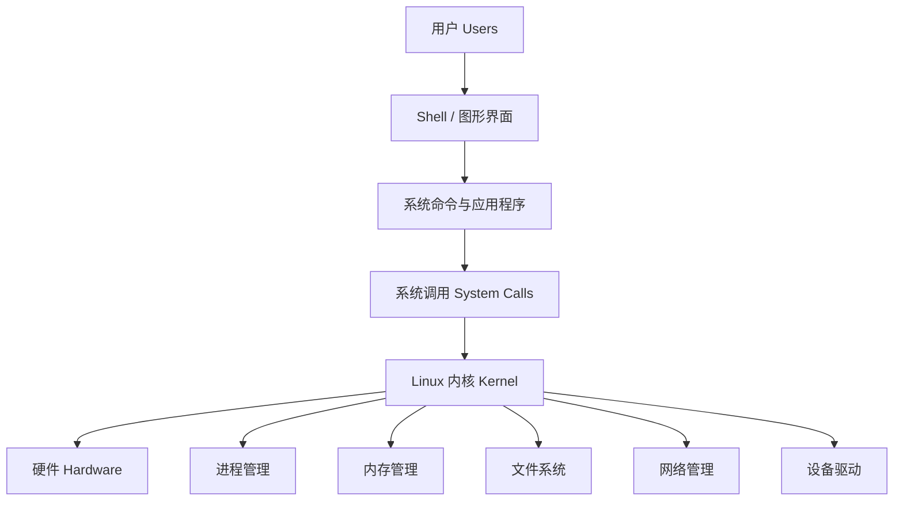
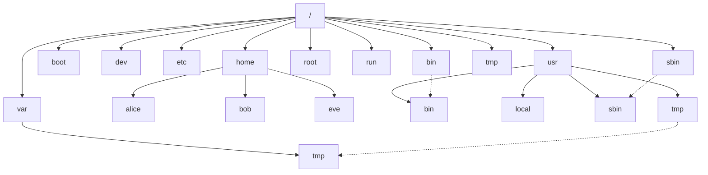
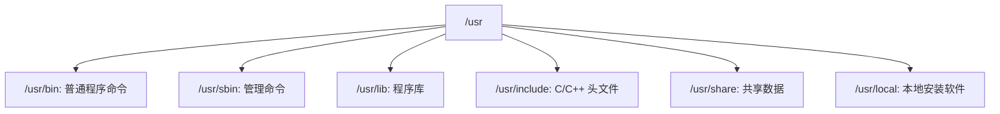
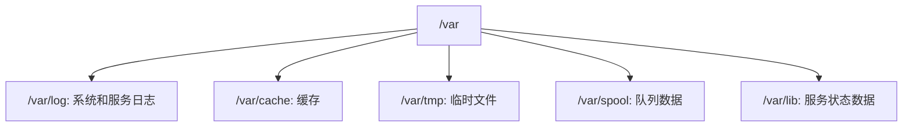
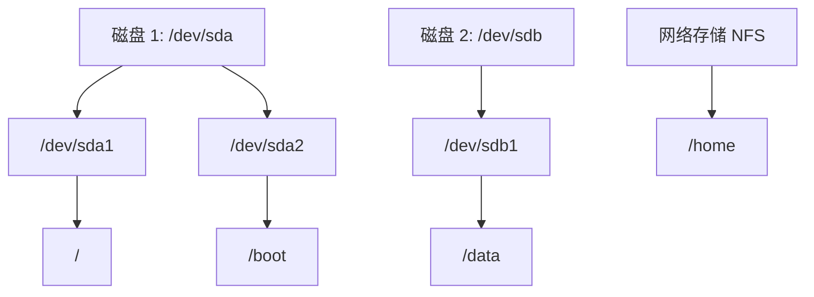
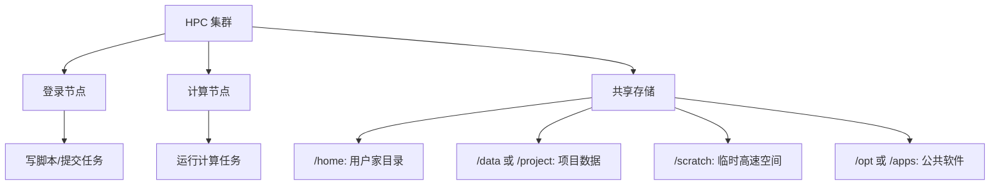

# Linux 组织架构与目录结构

Linux 的整体结构可以理解为：**内核负责管理硬件资源，Shell 和系统服务提供操作入口，用户程序运行在其上，所有内容都通过统一的文件系统组织起来**。

Linux 与 Windows 最大的不同之一是：Linux 没有 `C盘`、`D盘` 这样的盘符概念，而是从一个统一的根目录 `/` 开始，所有磁盘、设备、配置、程序、用户文件都挂载在这棵目录树下面。

## 1. Linux 系统整体架构



各层含义：

| 层级 | 说明 |
| --- | --- |
| 用户 | 使用系统的人或服务账号 |
| Shell / 图形界面 | 用户与系统交互的入口，如 Bash、Zsh、GNOME |
| 系统命令与应用程序 | 如 `ls`、`vim`、`python`、`gcc` |
| 系统调用 | 程序请求内核服务的接口 |
| Linux 内核 | 管理 CPU、内存、磁盘、网络、设备 |
| 硬件 | 真实的计算机资源 |

## 2. Linux 文件系统总览

Linux 文件系统从根目录 `/` 开始，常见结构如下：



## 3. 根目录 `/`

`/` 是 Linux 文件系统的起点，所有目录、文件、设备、挂载点都位于它下面。

```bash
cd /
ls
```

可以把 `/` 理解为整个系统目录树的“根”。

## 4. 常见一级目录说明

| 目录 | 作用 | 初学者理解 |
| --- | --- | --- |
| `/bin` | 基础用户命令 | 存放 `ls`、`cp`、`mv` 等基础命令 |
| `/sbin` | 系统管理命令 | 存放管理员使用的命令 |
| `/etc` | 系统配置文件 | 系统和服务的配置中心 |
| `/home` | 普通用户家目录 | 每个普通用户的个人目录 |
| `/root` | root 用户家目录 | 管理员 root 的 home |
| `/usr` | 用户级程序和库 | 大量软件、命令、库文件 |
| `/var` | 经常变化的数据 | 日志、缓存、数据库、邮件等 |
| `/tmp` | 临时文件 | 程序或用户临时存放文件 |
| `/opt` | 第三方软件 | 手动安装的大型软件常放这里 |
| `/dev` | 设备文件 | 磁盘、终端、GPU 等设备入口 |
| `/proc` | 内核和进程虚拟文件系统 | 查看进程、CPU、内存等运行状态 |
| `/sys` | 设备和内核虚拟文件系统 | 查看或管理硬件设备状态 |
| `/run` | 运行时数据 | 系统启动后产生的临时状态文件 |
| `/lib`、`/lib64` | 系统基础库 | 命令和程序运行依赖的库 |
| `/boot` | 启动文件 | 内核、引导加载器相关文件 |
| `/media` | 可移动设备挂载点 | U 盘、移动硬盘自动挂载位置 |
| `/mnt` | 临时挂载点 | 管理员手动挂载磁盘常用 |
| `/srv` | 服务数据 | Web、FTP 等服务的数据目录 |

## 5. `/bin` 与 `/sbin`

### `/bin`

`/bin` 存放系统最基础的用户命令，例如：

```bash
ls
cp
mv
rm
cat
mkdir
```

这些命令通常是系统启动后最基本也最常用的工具。

### `/sbin`

`/sbin` 存放系统管理命令，例如：

```bash
ip
fsck
reboot
shutdown
useradd
```

很多 `/sbin` 下的命令需要管理员权限。

```bash
sudo reboot
sudo useradd testuser
```

简单理解：

| 目录 | 面向对象 |
| --- | --- |
| `/bin` | 普通用户常用基础命令 |
| `/sbin` | 系统管理员常用命令 |

## 6. `/etc`：配置文件中心

`/etc` 保存系统和软件的配置文件。

常见文件或目录：

| 路径 | 说明 |
| --- | --- |
| `/etc/passwd` | 用户账号信息 |
| `/etc/group` | 用户组信息 |
| `/etc/shadow` | 用户密码哈希，普通用户不可读 |
| `/etc/ssh/` | SSH 服务和客户端配置 |
| `/etc/fstab` | 文件系统挂载配置 |
| `/etc/hosts` | 本地域名解析 |
| `/etc/os-release` | 系统发行版信息 |

示例：

```bash
cat /etc/os-release
cat /etc/hosts
```

注意：修改 `/etc` 下的配置通常需要 `sudo`，并且可能影响整个系统。

## 7. `/home`：普通用户家目录

普通用户的个人文件通常放在 `/home/用户名` 下。

例如：

```text
/home/alice
/home/bob
```

用户登录后默认一般会进入自己的 home 目录。

```bash
cd ~
pwd
```

`~` 表示当前用户的 home 目录。

常见内容：

```text
/home/alice/Documents
/home/alice/Downloads
/home/alice/.ssh
/home/alice/.bashrc
```

以 `.` 开头的文件是隐藏文件，例如：

| 文件 | 说明 |
| --- | --- |
| `~/.bashrc` | Bash Shell 配置 |
| `~/.ssh/` | SSH 密钥和配置 |
| `~/.vimrc` | Vim 配置 |
| `~/.profile` | 登录环境配置 |

查看隐藏文件：

```bash
ls -a ~
```

## 8. `/root`：root 用户家目录

`/root` 是管理员用户 `root` 的 home 目录，不是根目录 `/`。

| 路径 | 含义 |
| --- | --- |
| `/` | 整个 Linux 文件系统的根 |
| `/root` | root 用户的个人目录 |

普通用户通常没有权限访问 `/root`。

## 9. `/usr`：用户程序与共享资源

`/usr` 是 Linux 中非常重要的目录，存放大量用户级程序、库文件、头文件和文档。



常见目录：

| 路径 | 说明 |
| --- | --- |
| `/usr/bin` | 大多数普通命令 |
| `/usr/sbin` | 非基础系统管理命令 |
| `/usr/lib` | 软件库 |
| `/usr/include` | 编译程序需要的头文件 |
| `/usr/share` | 文档、图标、语言包等共享资源 |
| `/usr/local` | 本机手动安装的软件 |

例如：

```bash
which python3
which gcc
```

可能输出：

```text
/usr/bin/python3
/usr/bin/gcc
```

## 10. `/var`：变化的数据

`/var` 存放经常变化的数据，例如日志、缓存、队列、数据库文件等。



常见路径：

| 路径 | 说明 |
| --- | --- |
| `/var/log` | 日志文件 |
| `/var/cache` | 软件缓存 |
| `/var/tmp` | 可跨重启保留的临时文件 |
| `/var/lib` | 服务保存的数据 |
| `/var/spool` | 打印、邮件等队列 |

查看系统日志示例：

```bash
ls /var/log
less /var/log/syslog
```

不同发行版日志文件名可能不同。

## 11. `/tmp`：临时文件

`/tmp` 用于存放临时文件，所有用户通常都可以写入。

```bash
cd /tmp
touch test.txt
```

注意：

- `/tmp` 中的文件可能被系统自动清理。
- 不要把重要数据长期放在 `/tmp`。
- 多用户系统中，不要在 `/tmp` 放敏感文件。

## 12. `/opt`：第三方软件

`/opt` 常用于安装第三方大型软件或商业软件。

例如：

```text
/opt/intel
/opt/cuda
/opt/MATLAB
```

在 HPC 集群中，管理员安装的软件也可能放在 `/opt` 或共享软件目录中。

## 13. `/dev`：设备文件

Linux 把很多硬件设备也表示为文件，放在 `/dev` 下。

常见设备：

| 路径 | 说明 |
| --- | --- |
| `/dev/sda` | 第一块 SATA/SCSI 磁盘 |
| `/dev/nvme0n1` | NVMe 固态硬盘 |
| `/dev/null` | 黑洞设备，写入内容会被丢弃 |
| `/dev/zero` | 无限输出 0 的设备 |
| `/dev/tty` | 当前终端 |
| `/dev/random` | 随机数设备 |

示例：

```bash
lsblk
ls /dev
```

`/dev/null` 常见用法：

```bash
command > /dev/null
```

表示丢弃标准输出。

## 14. `/proc`：进程和内核信息

`/proc` 是虚拟文件系统，不是真实磁盘文件。它由内核动态生成，用于查看系统运行状态。

常见文件：

| 路径 | 说明 |
| --- | --- |
| `/proc/cpuinfo` | CPU 信息 |
| `/proc/meminfo` | 内存信息 |
| `/proc/version` | 内核版本 |
| `/proc/uptime` | 系统运行时间 |
| `/proc/PID/` | 某个进程的信息目录 |

示例：

```bash
cat /proc/cpuinfo
cat /proc/meminfo
cat /proc/version
```

查看当前 Shell 进程：

```bash
echo $$
ls /proc/$$
```

## 15. `/sys`：设备与内核对象

`/sys` 也是虚拟文件系统，主要用于展示设备、驱动、总线等内核对象。

常见路径：

| 路径 | 说明 |
| --- | --- |
| `/sys/class` | 按类别组织设备 |
| `/sys/block` | 块设备，如磁盘 |
| `/sys/bus` | 总线信息 |
| `/sys/devices` | 设备层级结构 |

初学者通常只需要知道：`/sys` 用于查看硬件和驱动状态，手动修改需谨慎。

## 16. `/run`：运行时状态

`/run` 存放系统本次启动后的运行时数据，例如进程 ID 文件、服务状态、Socket 文件等。

例如：

```text
/run/sshd.pid
/run/user/1000
```

特点：

- 重启后内容会重新生成。
- 普通用户通常不需要手动管理。

## 17. `/boot`：启动相关文件

`/boot` 存放系统启动所需文件，包括 Linux 内核和引导加载器配置。

常见内容：

```text
/boot/vmlinuz-*
/boot/initrd.img-*
/boot/grub/
```

注意：不要随意删除 `/boot` 下的文件，否则系统可能无法启动。

## 18. `/media` 与 `/mnt`：挂载点

Linux 中访问磁盘分区、U 盘、网络存储时，需要将它们“挂载”到某个目录。

### `/media`

通常用于桌面系统自动挂载 U 盘、移动硬盘。

```text
/media/alice/USB_DISK
```

### `/mnt`

常用于管理员临时手动挂载。

```bash
sudo mount /dev/sdb1 /mnt
ls /mnt
sudo umount /mnt
```

相关命令：

| 命令 | 说明 |
| --- | --- |
| `mount` | 挂载文件系统 |
| `umount` | 卸载文件系统 |
| `lsblk` | 查看磁盘和挂载点 |
| `df -h` | 查看已挂载文件系统空间 |

## 19. `/srv`：服务数据

`/srv` 用于存放系统对外提供服务的数据。

例如：

```text
/srv/www
/srv/ftp
```

实际使用中，Web 服务数据也常放在：

```text
/var/www
```

具体位置取决于发行版和管理员配置。

## 20. 文件系统、磁盘与挂载关系

Linux 的目录树不等于一块磁盘。不同目录可以来自不同磁盘、分区或网络存储。



查看挂载情况：

```bash
df -h
lsblk
mount
```

常见情况：

| 目录 | 可能来源 |
| --- | --- |
| `/` | 系统盘 |
| `/boot` | 独立启动分区 |
| `/home` | 本地磁盘或网络存储 |
| `/data` | 大容量数据盘 |
| `/scratch` | HPC 临时高速存储 |
| `/mnt` | 临时挂载设备 |

## 21. HPC 集群中的目录组织

HPC 集群常见目录可能与普通 Linux 服务器略有不同。



常见目录：

| 目录 | 说明 |
| --- | --- |
| `/home/用户名` | 用户个人目录，通常容量较小 |
| `/data` | 数据目录，可能按课题组或项目划分 |
| `/project` | 项目共享目录 |
| `/scratch` | 临时高速计算空间，可能定期清理 |
| `/opt`、`/apps` | 管理员安装的软件 |
| `/public` | 公共数据或共享资源 |

建议：

- 代码和脚本可放在 `/home`。
- 大数据和结果文件应放在 `/data`、`/project` 或 `/scratch`。
- 长期重要结果不要只放在 `/scratch`。
- 提交任务前确认脚本中的路径在计算节点也能访问。

## 22. Linux 中“一切皆文件”的思想

Linux 把很多资源抽象成文件：

| 类型 | 示例 |
| --- | --- |
| 普通文件 | `/home/alice/a.txt` |
| 目录 | `/home/alice/project` |
| 设备 | `/dev/sda` |
| 进程信息 | `/proc/1234` |
| 网络配置 | `/proc/net`、`/sys/class/net` |
| 管道和 Socket | `/run` 下的部分文件 |

这种设计使得很多资源都可以通过统一方式查看、读写和管理。

## 23. 初学者最常访问的目录

| 场景 | 常用目录 |
| --- | --- |
| 自己的文件 | `~`、`/home/用户名` |
| 系统配置 | `/etc` |
| 查看日志 | `/var/log` |
| 临时文件 | `/tmp` |
| 查看 CPU/内存 | `/proc/cpuinfo`、`/proc/meminfo` |
| 查看磁盘设备 | `/dev`、`lsblk` |
| 第三方软件 | `/opt`、`/usr/local` |
| HPC 数据 | `/data`、`/project`、`/scratch` |

## 24. 常用查看命令

```bash
pwd                 # 查看当前目录
ls /                # 查看根目录下有哪些一级目录
ls -lh              # 查看当前目录内容
ls -lah             # 包含隐藏文件
df -h               # 查看文件系统空间
lsblk               # 查看磁盘、分区、挂载点
mount               # 查看当前挂载情况
cat /etc/os-release # 查看系统发行版
cat /proc/cpuinfo   # 查看 CPU 信息
cat /proc/meminfo   # 查看内存信息
```

## 25. 总结

Linux 的组织架构可以从两个角度理解：

1. 系统层面：用户程序通过 Shell 和系统调用使用内核，内核管理硬件。
2. 文件层面：所有内容都组织在 `/` 开始的目录树中，不同目录承担不同职责。

最需要记住的目录：

| 目录 | 一句话理解 |
| --- | --- |
| `/` | 整个系统的根 |
| `/home` | 普通用户自己的文件 |
| `/etc` | 系统配置 |
| `/usr` | 大量程序和库 |
| `/var` | 日志、缓存等变化数据 |
| `/tmp` | 临时文件 |
| `/dev` | 设备文件 |
| `/proc` | 系统运行信息 |
| `/opt` | 第三方软件 |
| `/mnt` | 临时挂载 |
