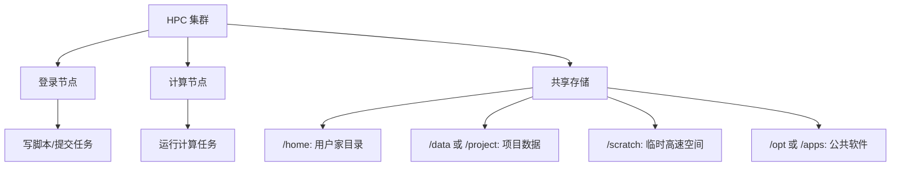

# HPC 集群任务调度

HPC 集群通常由登录节点和计算节点组成。用户在登录节点编写脚本、提交任务，调度系统再把任务分配到计算节点运行。常见调度系统有 Slurm 和 PBS。不同集群可能只安装其中一种。

## HPC 使用基本原则

- 不要在登录节点上直接运行大型计算任务。
- 使用调度命令提交任务。
- 提交前确认申请的 CPU、内存、GPU、运行时间是否合理。
- 任务输出和错误日志要保存，方便排查。
- 大量小文件和频繁读写可能影响共享文件系统性能。


## HPC 集群中的目录组织

HPC 集群常见目录可能与普通 Linux 服务器略有不同。



常见目录：

| 目录 | 说明 |
| --- | --- |
| `/home/用户名` | 用户个人目录，通常容量较小 |
| `/data` | 数据目录，可能按课题组或项目划分 |
| `/project` | 项目共享目录 |
| `/scratch` | 临时高速计算空间，可能定期清理 |
| `/opt`、`/apps` | 管理员安装的软件 |
| `/public` | 公共数据或共享资源 |

建议：

- 代码和脚本可放在 `/home`。
- 大数据和结果文件应放在 `/data`、`/project` 或 `/scratch`。
- 长期重要结果不要只放在 `/scratch`。
- 提交任务前确认脚本中的路径在计算节点也能访问。

## 8. 集群节点查看

不同 HPC 集群可能使用不同调度系统。常见为 Slurm 或 PBS。

### Slurm 节点信息

```bash
sinfo
sinfo -N
sinfo -Nel
scontrol show node
```

常用命令：

| 命令 | 说明 |
| --- | --- |
| `sinfo` | 查看分区和节点总体状态 |
| `sinfo -N` | 按节点显示 |
| `sinfo -Nel` | 显示更详细的节点信息 |
| `scontrol show node` | 显示节点详细配置 |

常见节点状态：

| 状态 | 说明 |
| --- | --- |
| `idle` | 空闲 |
| `alloc` | 已分配 |
| `mix` | 部分资源被占用 |
| `down` | 不可用 |
| `drain` | 正在排空，不再接收新任务 |

### PBS 节点信息

```bash
pbsnodes
pbsnodes -a
pbsnodes -l
```

常用参数：

| 参数 | 说明 |
| --- | --- |
| `-a` | 查看所有节点详细信息 |
| `-l` | 查看离线或不可用节点 |