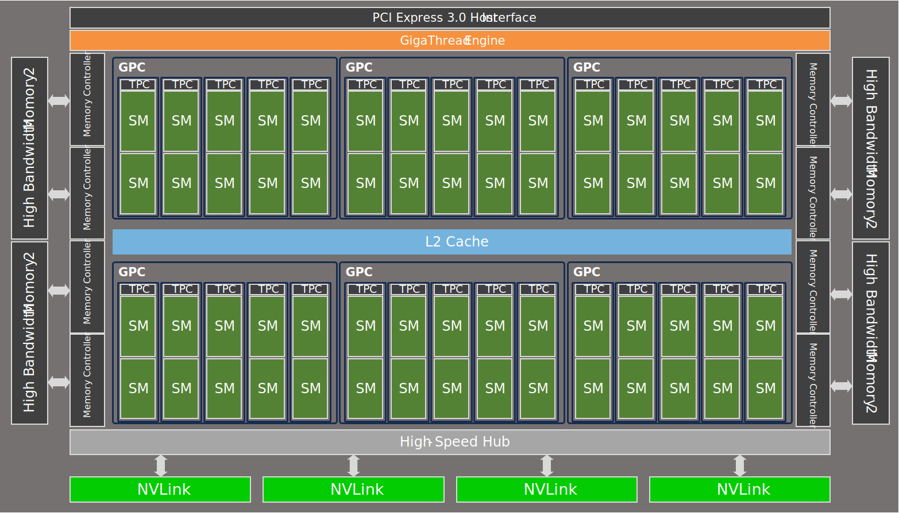
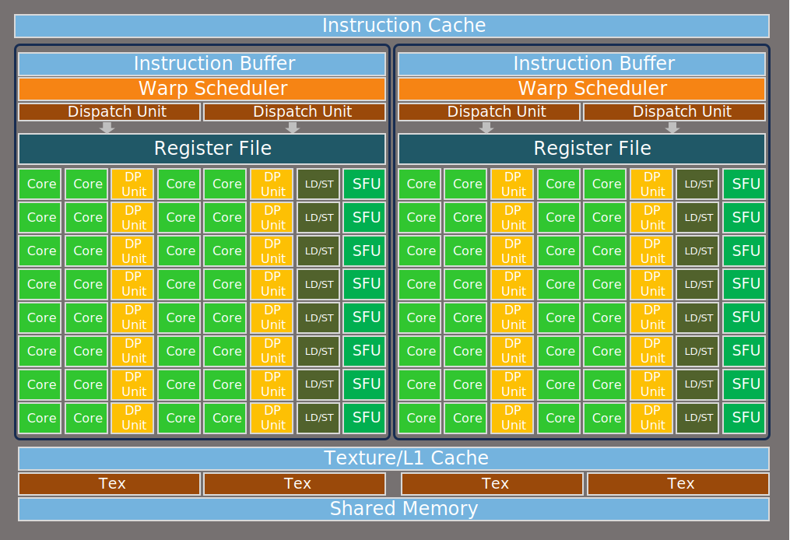
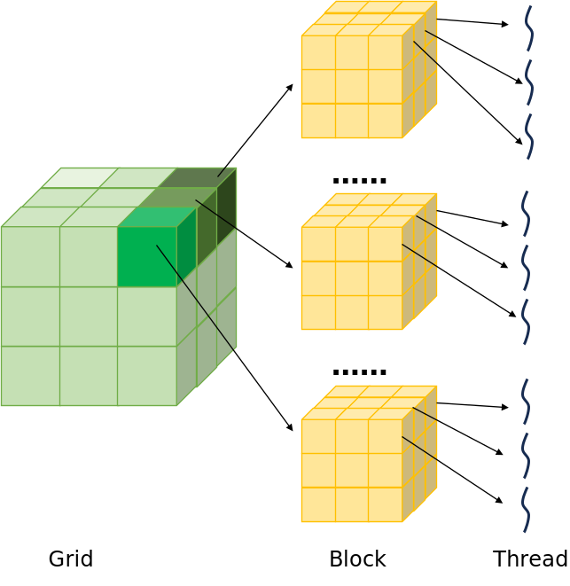
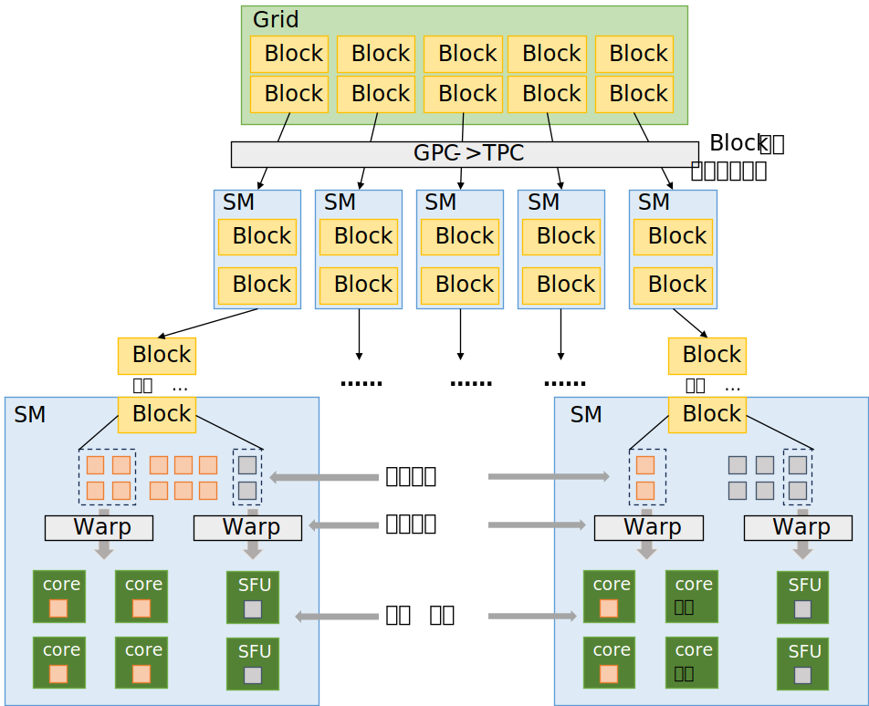
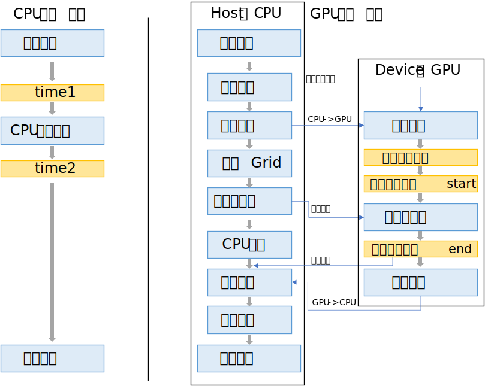

# GPU架构和编程

我们都知道GPU作为AI训练必不可少的元件，起到加速并行计算的作用，本节将以`NVIDIA Pascal GPU`架构为例，简单介绍GPU的架构逻辑，并通过CUDA的C/C++接口对GPU进行编程，通过一个极大矩阵的求和运算生动的比较CPU和GPU的功能和长处，理解GPU强大的并行计算能力。

## GPU架构

下图是`NVIDIA Pascal GPU`架构的GP100 GPU架构图，整个GPU系统按层级被划分为Engine->GPC->TPC->SM->Warp->Core，其中SM（流式多处理器）是可独立调度任务并提供完整协作资源的最小硬件单元，Core是进行实际运算的最小单元，相当于CPU中的ALU，GPU中的Core又有整数/浮点数计算单元、双精度浮点数单元和特殊函数计算单元，每个单元的数量在不同GPU中各不相同。

Giga Thread Engine管理所有进行的工作量，调度管理所有的线程任务，GPC和TPC分级管理一部分可用资源，所有GPC单元共享L2缓存，同时GPU还有外置高速缓存，也就是显存。




每个SM单元的结构如下，一个SM内有两个warp调度器，64个cuda core单元、32个DP双精度浮点数运算单元、16个SFU特殊函数运算单元、16个LD/ST存储单元，三类计算单元对应不同指令类型，LD/ST单元负责内存数据搬运‌。每个SM单元有自己的寄存器、L1缓存和共享内存。




在这个示例GPU中，有6个GPC，每个GPC5个TPC，每个TPC有2个SM单元，每个SM单元有2个Warp调度器，每个调度器管理32个Core、16个DP Core、8个SFU Core，那么可以计算：

$$
\begin{align*}
Total \quad Core &= 6 \times 5 \times 2 \times 2 \times 32 = 3840 \\
Total \quad DP &= 6 \times 5 \times 2 \times 2 \times 16 = 1920 \\
Total \quad SFU &= 6 \times 5 \times 2 \times 2 \times 8 = 960
\end{align*}
$$

在理论上，该GPU同一周期可以并行同时执行3840个线程计算任务，1920个双精度计算，960个特殊函数计算任务。

## 并行执行调度

Grid、Block、Thread三个软件层级，一个CUDA计算程序会被视为一个Grid，一个Grid包含多个Block，每个Block中又包含多个线程，每个线程对于一个具体的计算过程。Gird和Block的维度只是面向开发人员的逻辑维度，并不是硬件层面的实际逻辑，因此三维的Grid和一维的Grid本质上等价的，为了实现“打包”的过程。



在程序启动后，Grid会被分割成多个Block，经Engine分配给多个SM，一个Block只能分配给一个SM单元，一个SM单元可以接受多个Block，但同一时间只能处理部分Block，其余的将接受等待。

SM分配到Block后对其进行拆解，每个Warp最多32个线程（GPU约定），Warp调度器会把线程分配给不同Core，每个Warp同一周期只能执行同种指令（SIMT 特性），线程分配到Core中后就会执行运算过程，在合理的分配调度下，整个GPU可以同时计算非常多个计算。



如果用橙色方块代表整型计算线程，灰色块表示特殊函数计算线程，那么左图的Block中四个整型计算任务和两个特殊函数计算任务分别调度到core和SFU core中，该SM单元被完全利用，其他整型计算线程等待core空闲后继续执行；而右图的Block全部两个整型计算任务被分配到core单元，而特殊函数任务被分配到SFU单元，这时还有2个core空闲，有4个特殊函数计算任务中等待SFU空闲（因为core不能计算特殊函数任务！），这样导致该SM并没有完全被占用，出现资源空闲。

## CUDA编程

学习CUDA编程的一手信源是[CUDA C++ Guide](https://docs.nvidia.com/cuda/cuda-c-programming-guide/index.html#)官网，本文通过一个矩阵运算来简单实现对GPU的编程。

GPU代码通常写在`.cu`文件中，并通过`#include <cuda_runtime.h>`来调用CUDA接口，这是CUDA官方提供的C/C++拓展语法。使用`__global__`关键字标注的函数将会被视为“核函数”，在GPU上运行；`cudaMalloc`、`cudaMemcpy`、`cudaFree`来管理GPU内存，使用如下语法执行核函数，其中`<<< >>>`来配置核函数。

```C++
Function<<<gridDim, blockDim>>>(a,b,c);
```

导入外部库文件
```C++
#include <cuda_runtime.h>
#include <stdio.h>
#include <stdlib.h>
#include <time.h>
```

定义一个N阶方阵
```C++
#define MATRIX_SIZE 23170
```

对于普通的CPU计算，我们只需要遍历矩阵每个元素，把他们按位相加即可，需要遍历$N^2$次。

```C++
void cpu_matrix_add(float *h_A, float *h_B, float *h_C, int size) {
    for (int i = 0; i < size; i++) {
        for (int j = 0; j < size; j++) {
            h_C[i * size + j] = h_A[i * size + j] + h_B[i * size + j];
        }
    }
}
```

对于GPU函数，如果有$x$个CUDA核心，那么只需要执行$\frac{N^2}{x}$次就会全部计算完成，函数中的$i,j$是线程索引。
```C++
__global__ void gpu_matrix_add(float *d_A, float *d_B, float *d_C, int size) {
    int i = blockIdx.y * blockDim.y + threadIdx.y;
    int j = blockIdx.x * blockDim.x + threadIdx.x;
    if (i < size && j < size) {
        d_C[i * size + j] = d_A[i * size + j] + d_B[i * size + j];
    }
}
```


CUDA API并不会主动显示报错，我们需要手动实现一个CUDA报错的宏定义：
```C++
#define CHECK_CUDA_ERROR(func) do { \
    cudaError_t err = func; \
    if (err != cudaSuccess) { \
        printf("CUDA Error: %s (line %d)\n", cudaGetErrorString(err), __LINE__); \
        exit(1); \
    } \
} while(0)
```

这个宏定义接受函数`func`，在编译阶段`CHECK_CUDA_ERROR(func(a,b))`等价于：

```C++
do {
    cudaError_t err = func(a,b);
    if (err != cudaSuccess) { 
        printf("CUDA Error: %s (line %d)\n", cudaGetErrorString(err), __LINE__); 
        exit(1); 
    }
} while(0)
```

下面是主函数，对于单线程CPU任务，只需要开辟内存、执行运算、释放内存即可；而对于GPU任务，需要经历开开辟显存、拷贝数据、配置核函数、执行核函数、CPU等待、拷贝数据、释放显存几个主要步骤：



整个过程的代码如下：

```C++
int main() {
    // 设定矩阵大小，这里直接用方阵
    int size = MATRIX_SIZE;
    size_t matrix_bytes = size * size * sizeof(float);

    
    printf("=== Large Matrix Addition: CPU vs GPU ===\n");
    printf("Matrix Size: %d x %d\n", size, size);
    printf("Single Matrix Data Size: %.2f GB\n", (float)matrix_bytes / (1024*1024*1024));
    printf("Total Data Size (A+B+C): %.2f GB\n", (float)(3 * matrix_bytes) / (1024*1024*1024));
    printf("=========================================\n\n");

    // 分配内存，h_A、h_B是要求和的矩阵，h_C_cpu、h_c_gpu是计算结果
    float *h_A = (float*)malloc(matrix_bytes);
    float *h_B = (float*)malloc(matrix_bytes);
    float *h_C_cpu = (float*)malloc(matrix_bytes);
    float *h_C_gpu = (float*)malloc(matrix_bytes);

    if (!h_A || !h_B || !h_C_cpu || !h_C_gpu) {
        printf("CPU Memory Allocation Failed!\n");
        exit(1);
    }

    // 要求和的矩阵值进行随机初始化
    srand((unsigned int)time(NULL));
    for (int i = 0; i < size * size; i++) {
        h_A[i] = (float)rand() / RAND_MAX;
        h_B[i] = (float)rand() / RAND_MAX;
    }

    // 开始执行CPU求和函数，并打点计时
    printf("Starting CPU Matrix Addition...\n");
    clock_t cpu_start = clock();
    cpu_matrix_add(h_A, h_B, h_C_cpu, size);
    clock_t cpu_end = clock();
    double cpu_time = (double)(cpu_end - cpu_start) / CLOCKS_PER_SEC;
    printf("CPU Addition Completed! Time: %.2f seconds\n\n", cpu_time);

    // 分配显存
    float *d_A, *d_B, *d_C;
    CHECK_CUDA_ERROR(cudaMalloc((void**)&d_A, matrix_bytes));
    CHECK_CUDA_ERROR(cudaMalloc((void**)&d_B, matrix_bytes));
    CHECK_CUDA_ERROR(cudaMalloc((void**)&d_C, matrix_bytes));

    // 复制矩阵A、B到显存中
    CHECK_CUDA_ERROR(cudaMemcpy(d_A, h_A, matrix_bytes, cudaMemcpyHostToDevice));
    CHECK_CUDA_ERROR(cudaMemcpy(d_B, h_B, matrix_bytes, cudaMemcpyHostToDevice));

    // 配置Grid和Block，每个Block 32x32 = 1024线程
    // 根据总线程数和Block大小划分Grid，总线程数就是需要计算的矩阵元素数目
    // (size + blockDim.x - 1) / blockDim.x 向上取整
    dim3 blockDim(32,32);
    dim3 gridDim(
        (size + blockDim.x - 1) / blockDim.x,
        (size + blockDim.y - 1) / blockDim.y
    );

    // GPU计时器
    cudaEvent_t gpu_start, gpu_end;
    CHECK_CUDA_ERROR(cudaEventCreate(&gpu_start));
    CHECK_CUDA_ERROR(cudaEventCreate(&gpu_end));

    printf("Starting GPU Matrix Addition...\n");
    CHECK_CUDA_ERROR(cudaEventRecord(gpu_start, 0));

    // 执行核函数
    gpu_matrix_add<<<gridDim, blockDim>>>(d_A, d_B, d_C, size);

    CHECK_CUDA_ERROR(cudaEventRecord(gpu_end, 0));
    CHECK_CUDA_ERROR(cudaEventSynchronize(gpu_end));

    // 计算计算用时
    float gpu_time_ms;
    // 此时的时间插值是核函数启动到运行结束的时间
    CHECK_CUDA_ERROR(cudaEventElapsedTime(&gpu_time_ms, gpu_start, gpu_end));
    double gpu_time = gpu_time_ms / 1000.0;
    printf("GPU Addition Completed! Time: %.4f seconds\n\n", gpu_time);

    // 把计算结果从内存中拷贝回内存
    CHECK_CUDA_ERROR(cudaMemcpy(h_C_gpu, d_C, matrix_bytes, cudaMemcpyDeviceToHost));

    // 输出时间结果
    printf("\n=== Performance Comparison ===\n");
    printf("CPU Time: %.2f seconds\n", cpu_time);
    printf("GPU Time: %.4f seconds\n", gpu_time);
    printf("GPU is %.2f times faster than CPU\n", cpu_time / gpu_time);
    printf("==============================\n");

    // 最后释放内存和显存
    free(h_A); free(h_B); free(h_C_cpu); free(h_C_gpu);
    CHECK_CUDA_ERROR(cudaFree(d_A));
    CHECK_CUDA_ERROR(cudaFree(d_B));
    CHECK_CUDA_ERROR(cudaFree(d_C));
    CHECK_CUDA_ERROR(cudaEventDestroy(gpu_start));
    CHECK_CUDA_ERROR(cudaEventDestroy(gpu_end));

    return 0;
}
```


## 编译

编译CUDA程序需要NVCC编译器，它主要是将代码分割为主机代码和GPU代码，对于GPU代码使用CUDA专用工具编译，而GPU代码使用系统默认编译器编译，最后通过链接器等合并生成可执行文件。

在Linux下安装nvcc后在命令行运行编译即可，在Win系统下需要安装MSVC编译器，并加载`x64 Native Tools Command Prompt for VS 2022`模块才能正确链接MVSC编译器。

最后我们直接执行nvcc编译命令即可得到可执行文件：
```bash
nvcc test.cu
```
## 结果比较

我们运行程序，可以看到创建的矩阵大小是$2317 \times 23170$，单个矩阵占用2GB内存，总占用6GB内存，其中CPU计算用时$1.07s$，GPU计算用时$0.0184s$，GPU是CPU的57倍！足以可见GPU在并行计算方面的速度。

```bash
=== Large Matrix Addition: CPU vs GPU ===
Matrix Size: 23170 x 23170
Single Matrix Data Size: 2.00 GB
Total Data Size (A+B+C): 6.00 GB
=========================================

Starting CPU Matrix Addition...
CPU Addition Completed! Time: 1.07 seconds

Starting GPU Matrix Addition...
GPU Addition Completed! Time: 0.0184 seconds


=== Performance Comparison ===
CPU Time: 1.07 seconds
GPU Time: 0.0184 seconds
GPU is 57.89 times faster than CPU
==============================
```