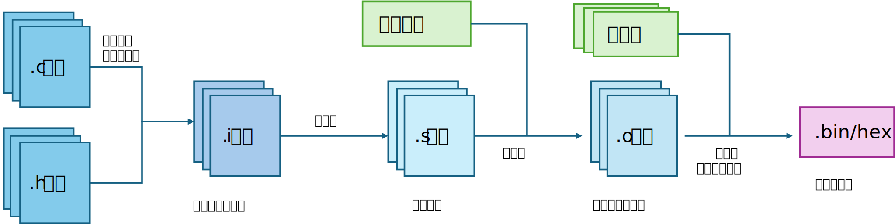

# 使用cmake开发stm32程序

很长一段时间开发单片机程序需要使用Keil软件，但该软件存在闭源、界面老旧、智能提示较差等缺点；ST公司推出的CubeMX/CubeIDE随实现了图形化配置，但项目仍然不自由，且封装较高，不适宜学习底层原理，CubeIDE的界面也略显老旧，编码体验较差。此外，常有开发者使用Vscode的STM插件配合CubeMX开发，但这些工具插件需要下载配置，且文件散乱难以管理，占用空间较大。

为了彻底脱离某个IDE的限制，实现多平台、多软件开发，同时体验高效的代码补全好提示，本文章将介绍使用现代化Cmake构建工具和arm-gcc编译工具链创建独立项目，彻底脱离传统IDE的限制，实现多平台、最小化、高效开发STM32程序。使用者无需额外下载任何软件，只要配置好工具链即可无缝适配任何一款支持cmake构建的IDE。

## 介绍

STM32F1系列芯片的选型介绍

| 后缀部分 | 含义                          | 芯片特征（Flash/RAM 大小）|
|----------|-------------------------------|-------------------------------------------|
| `ld`     | Low density（低密度）| Flash ≤ 16KB，RAM ≤ 4KB（如 STM32F101/102） |
| `md`     | Medium density（中密度）| Flash 32~64KB，RAM 6~10KB（如 STM32F103C8） |
| `hd`     | High density（高密度）| Flash 128~512KB，RAM 16~64KB（如 STM32F103VE） |
| `xl`     | XL density（超高密度）| Flash ≥ 512KB（如 STM32F103ZE）|
| `cl`     | Connectivity line（互联型）| 带 CAN/USB 等外设的高密度芯片（如 STM32F105/107） |
| `vl`     | Value line（超值型）| 低成本版本的 ld/md/hd 芯片（如 STM32F100）|

## C项目编译流程

一个多文件C项目一般都需要以下编译流程。预编译阶段会展开头文件，替换宏定义，得到纯文本的代码文件`.i`，随后汇编器将`.i`文件转成`.s`汇编代码，汇编器再把所有汇编文件和启动文件各自编译为`.o`文件，最后由链接器把`.o`文件链接合并为可执行文件`.bin/hex`文件。



### startup启动文件

`startup`文件夹中提供了各种型号MCU的 `.s` 文件，它们是**汇编语言编写的启动文件**，是 STM32 芯片上电复位后执行的第一段代码，也是连接硬件和 C 语言程序 `main()` 的桥梁，核心功能包括：
- **初始化堆栈**：设置栈的大小和起始地址，为函数调用、局部变量分配内存；
- **初始化堆**（可选）：为 `malloc()` 等动态内存分配函数提供空间；
- **设置中断向量表**：定义复位、异常、外设中断的入口地址；
- **初始化系统时钟**：调用`system_stm32f10x.c` 中的 `SystemInit()` 函数配置的主频；
- **跳转到 `main()` 函数**：完成底层初始化后，进入用户编写的 C 语言主函数。

### 链接脚本

程序编译完成后需要链接器按链接脚本链接得到可执行文件，其核心功能包括：

- **内存布局定义**：定义 STM32 的 Flash 和 RAM 大小和起始地址；
- **段分配规则**：配置链接器将编译生成的各段放到MEMORY里的不同区域；
- **符号定义**：`.ld` 文件中定义的`_etext`/`_sdata`/`_ebss`等符号，会被启动文件（`.s`）引用：
- **栈/堆大小定义**：部分 `.ld` 文件会定义栈和堆的大小，也可以在启动文件中定义。

## 工具链的安装

为了更好的管理复杂的代码文件，以及更方便的编译项目，我们需要一套完整的编译工具链：

## arm-gcc

这是是针对 ARM 架构处理器的交叉编译器套件，是嵌入式 ARM 开发的核心编译工具。

所谓交叉编译就是在 x86/x64 主机上编译出能在 ARM 芯片上运行的二进制程序（.elf/.bin/.hex 文件）。

arm-gcc的核心组件包括：
- **arm-none-eabi-gcc**：核心编译器，负责将 C/C++ 源代码编译为 ARM 架构的汇编代码 / 目标文件；
- **arm-none-eabi-ld**：链接器，将多个目标文件、库文件链接成最终的可执行文件；
- **arm-none-eabi-objcopy**：格式转换工具，将 .elf 文件转为嵌入式芯片可烧录的 .bin/.hex 文件；
- **arm-none-eabi-gdb**：调试器，配合 OpenOCD 进行硬件调试。

arm-gcc下载官网在[此处](https://developer.arm.com/downloads/-/arm-gnu-toolchain-downloads)，需要添加到环境变量中。

验证安装：
```bsah
arm-none-eabi-gcc --version
```

## cmake

CMake 是一个跨平台的构建系统生成工具，它不是直接的编译器/构建器，而是生成构建规则。这样只需一套 CMakeLists.txt，就能生成适配不同平台（Windows/Linux/macOS）、不同构建工具（Make/Ninja）、不同编译器（arm-gcc/Clang）的构建规则。

cmake下载官网在[此处](https://cmake.org/download/)，需要添加到环境变量中。

验证安装：
```bash
cmake --version
```

## ninja

Ninja 是一个轻量级、高性能的构建执行工具，可以代替传统的 Make构建工具。Ninja 本身不写构建规则，而是执行 CMake 生成的 build.ninja 文件。

ninja下载官网在[此处](https://ninja-build.org/)，需要添加到环境变量中。

验证安装：
```bash
ninja --version
```

### openocd

OpenOCD 是开源的片上调试 / 烧录工具，负责将编译好的程序烧录到 ARM 芯片，并提供调试接口，支持绝大多数 ARM 芯片和调试器。

openocd下载官网在[此处](https://openocd.org/pages/getting-openocd.html)，需要添加到环境变量中。

验证安装：
```bash
openocd --version
```


