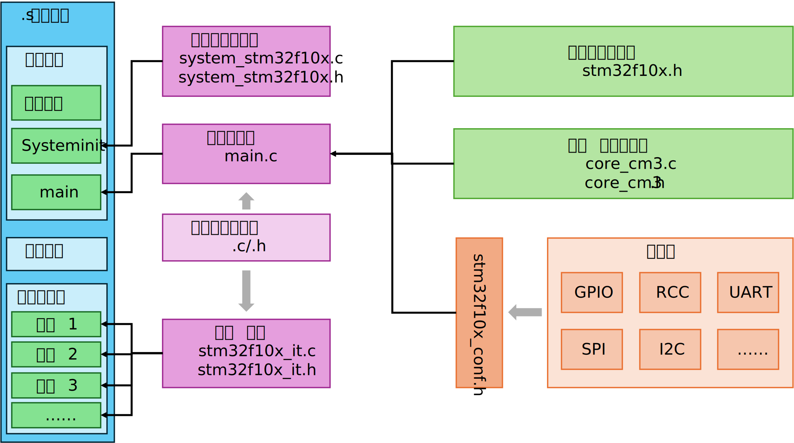

# 标准库

ST-标准库可以在[官网](https://www.st.com.cn/zh/embedded-software/stm32-standard-peripheral-libraries.html)下载

stm32标准库的文件结构如下，这里我们只需要`Libraries`文件夹即可，`Project`示例文件夹可以单独保存，其他文件可以删除。

```bash
.
├── _htmresc                        网页文档
├── Libraries                       标准库源码
├── Package_license.html            许可证文件
├── Package_license.md              md说明
├── Project                         一些示例程序
├── Release_Notes.html              版本说明
├── stm32f10x_stdperiph_lib_um.chm  帮助手册
└── Utilities                       基于官方开发版的示例
```

进入`Libraries`文件夹，看到如下结构：
```bash
Libraries
├── CMSIS                           CMSIS内核
│   ├── CM3                         内核核心源码
│   ├── CMSIS changes.htm           版本更新说明
│   ├── CMSIS debug support.htm     调试支持
│   ├── Documentation               帮助文档
│   └── License.doc                 许可证
└── STM32F10x_StdPeriph_Driver      STM32标准外设驱动库
    ├── inc                         头文件
    ├── LICENSE.txt                 许可证
    ├── Release_Notes.html          版本说明
    └── src                         源文件
```

把多余的文档、许可证可以删除，只保留以下文件：
```bash
Libraries
├── CMSIS                           CMSIS内核
│   └── CM3                         内核核心源码
└── STM32F10x_StdPeriph_Driver      STM32标准外设驱动库
    ├── inc                         头文件
    └── src                         源文件
```

## 外设驱动层

首先介绍一下`STM32F10x_StdPeriph_Driver`的内容，`inc`和`src`分别是标准外设驱动的头文件和源文件：

| 源文件               | 头文件               | 功能介绍                                                                 |
|----------------------|----------------------|--------------------------------------------------------------------------|
| misc.c               | misc.h               | 包含 NVIC（嵌套向量中断控制器）、SYSTICK（系统滴答定时器）等通用中断/系统配置函数 |
| stm32f10x_adc.c      | stm32f10x_adc.h      | 模拟/数字转换（ADC）外设驱动，实现ADC通道配置、采样、转换等功能           |
| stm32f10x_bkp.c      | stm32f10x_bkp.h      | 备份寄存器（BKP）驱动，用于保存掉电后需要保留的数据（如RTC配置、用户数据） |
| stm32f10x_can.c      | stm32f10x_can.h      | 控制器局域网（CAN）总线外设驱动，实现CAN通信协议的收发、过滤等功能        |
| stm32f10x_cec.c      | stm32f10x_cec.h      | 消费电子控制（CEC）外设驱动，用于HDMI/CEC总线的设备间通信                |
| stm32f10x_crc.c      | stm32f10x_crc.h      | CRC（循环冗余校验）外设驱动，实现数据校验、生成CRC码等功能                |
| stm32f10x_dac.c      | stm32f10x_dac.h      | 数字/模拟转换（DAC）外设驱动，实现数字信号到模拟电压的转换                |
| stm32f10x_dbgmcu.c   | stm32f10x_dbgmcu.h   | 调试MCU（DBGMCU）驱动，用于配置调试模式、冻结外设（如定时器）等调试功能   |
| stm32f10x_dma.c      | stm32f10x_dma.h      | 直接内存访问（DMA）外设驱动，实现外设与内存/内存与内存的高速数据传输      |
| stm32f10x_exti.c     | stm32f10x_exti.h     | 外部中断/事件控制器（EXTI）驱动，配置GPIO等外设的外部中断触发方式         |
| stm32f10x_flash.c    | stm32f10x_flash.h    | FLASH闪存驱动，实现FLASH的读写、擦除、保护等操作                          |
| stm32f10x_fsmc.c     | stm32f10x_fsmc.h     | 灵活静态存储控制器（FSMC）驱动，用于扩展外部SRAM、NOR/NAND FLASH等存储设备 |
| stm32f10x_gpio.c     | stm32f10x_gpio.h     | 通用输入输出（GPIO）外设驱动，配置引脚方向、电平、上下拉、复用功能等       |
| stm32f10x_i2c.c      | stm32f10x_i2c.h      | 集成电路总线（I2C）外设驱动，实现I2C主/从模式的数据收发                  |
| stm32f10x_iwdg.c     | stm32f10x_iwdg.h     | 独立看门狗（IWDG）驱动，用于监控程序运行，超时自动复位MCU                 |
| stm32f10x_pwr.c      | stm32f10x_pwr.h      | 电源管理（PWR）外设驱动，配置低功耗模式、电源监测等功能                  |
| stm32f10x_rcc.c      | stm32f10x_rcc.h      | 复位和时钟控制（RCC）驱动，配置系统时钟、外设时钟使能/失能               |
| stm32f10x_rtc.c      | stm32f10x_rtc.h      | 实时时钟（RTC）驱动，实现时间/日期的读写、闹钟、周期性中断等功能          |
| stm32f10x_sdio.c     | stm32f10x_sdio.h     | SDIO接口驱动，用于访问SD卡、MMC卡等存储设备                              |
| stm32f10x_spi.c      | stm32f10x_spi.h      | 串行外设接口（SPI）驱动，实现SPI主/从模式的高速数据收发                  |
| stm32f10x_tim.c      | stm32f10x_tim.h      | 定时器（TIM）外设驱动，实现定时、计数、PWM输出、输入捕获等功能            |
| stm32f10x_usart.c    | stm32f10x_usart.h    | 通用同步/异步收发器（USART）驱动，实现串口通信（UART/USART）              |
| stm32f10x_wwdg.c     | stm32f10x_wwdg.h     | 窗口看门狗（WWDG）驱动，用于监控程序运行，仅在指定窗口内喂狗有效          |

## 内核层

以下是CMSIS内核部分的源码结构，主要需要关注的是在 `/CM3/CoreSupport/` 文件夹下的CMSIS源码，他提供了内核级寄存器配置。

同时在`startup`文件夹中提供了不同编译器的启动文件，我们使用arm-gcc的话，只需要保留gcc文件夹即可。
```bash
.
└── CM3
    ├── CoreSupport
    │   ├── core_cm3.c                      M3内核代码源文件
    │   └── core_cm3.h                      M3内核代码头文件
    └── DeviceSupport
        └── ST
            └── STM32F10x
                ├── LICENSE.txt             许可证文件
                ├── Release_Notes.html      版本介绍
                ├── startup                 启动文件.s
                │   ├── arm                 keil工程的启动文件
                │   ├── gcc_ride7           gcc编译器的启动文件
                │   ├── iar                 iar工程的启动文件
                │   └── TrueSTUDIO          其他项目的启动文件
                ├── stm32f10x.h             片上外设的所有寄存器的映射
                ├── system_stm32f10x.c      系统时钟初始化配置文件
                └── system_stm32f10x.h      对应的头文件
```


## 配置文件

随后我们需要中在`Project\STM32F10x_StdPeriph_Template`下找到官方提供的空项目，找到中断函数文件`stm32f10x_it.c`、 `stm32f10x_it.h`，项目配置文件`stm32f10x_conf.h`，初始化文件`system_stm32f10x.c`，这个文件在内核文件夹中也有，因此无需重复包含了。

```bash
STM32F10x_StdPeriph_Template/STM32F10x_StdPeriph_Template
├── EWARM
├── HiTOP
├── LICENSE.txt
├── main.c                          主程序入口
├── MDK-ARM
├── Release_Notes.html
├── RIDE
├── stm32f10x_conf.h                配置文件
├── stm32f10x_it.c                  中断函数源文件
├── stm32f10x_it.h                  中断函数头文件
├── system_stm32f10x.c              系统初始化文件（和内核文件重复）
└── TrueSTUDIO
```

## 链接脚本

我们的程序正确编译成可执行文件还需要一个链接脚本`.ld`文件，我们在`Project`文件夹中任意找一个即可（可通用）：
```bash
./RIDE/stm32f10x_flash_extsram.ld
./TrueSTUDIO/STM3210B-EVAL/stm32_flash.ld
./TrueSTUDIO/stm32f10x_flash_extsram.ld
./TrueSTUDIO/STM32100E-EVAL/stm32_flash.ld
./TrueSTUDIO/STM3210C-EVAL/stm32_flash.ld
./TrueSTUDIO/STM32100B-EVAL/stm32_flash.ld
./TrueSTUDIO/STM3210E-EVAL/stm32_flash.ld
./TrueSTUDIO/STM3210E-EVAL_XL/stm32_flash.ld
```

> [!CAUTION]
> 若标准库的链接文件无法使用，可以复制HAL库的链接文件，后者维护性更好。移植后只需要修改CMakeLists.txt中的链接脚本文件名即可。

## 标准库的项目架构

最终，我们把没用的文档和许可证文件删除，将内核代码和外设驱动库提取出来，得到最简工程文件夹结构：
```bash
.
├── CMakeLists.txt                          工程cmake脚本
├── openocd.cfg                             openocd配置
├── build                                   编译目录
├── Drivers/                                驱动层代码
│   ├── CMSIS/                              CMSIS层代码
│   │   ├── core_cm3.c                      内核源文件
│   │   ├── core_cm3.h                      内核头文件
│   │   ├── stm32f10x.h                     片上外设的所有寄存器的映射
│   │   ├── system_stm32f10x.c              系统时钟初始化配置源文件
│   │   └── system_stm32f10x.h              系统时钟初始化配置头文件
│   ├── Start/                              编译启动脚本
│   │   ├── boot/                           各型号.s启动脚本
│   │   └── linker/                         各型号.ld链接脚本
│   └── STM32F10x_StdPeriph_Driver/         标准库驱动
│       ├── inc/                            标准库头文件
│       └── src/                            标准库源文件
└── User/                                   用户层代码
    ├── main.c                              main文件
    ├── stm32f10x_conf.h                    总配置文件
    ├── stm32f10x_it.c                      中断函数源文件
    └── stm32f10x_it.h                      中断函数头文件
.../                                        其他用户文件（外设驱动等）
```

同时总结了STM32标准库的项目架构。在单片机上电后首先执行的是启动文件的汇编代码，进入复位中断完成初始化配置，随后执行`Systeminit`函数（在相应文件中实现）对单片机配置默认主频的时钟，配置好后开始执行main函数，控制权交由用户程序，这时再根据用户配置的时钟调整，同时激活对应的外设寄存器。

启动文件中另一个重要部分是中断向量表，它记录了单片机需要的中断函数函数名，链接阶段将通过函数名来汇总可执行文件。用户实现的中断函数可以放在`stm32f10x_it`中，也可以写在其他任意位置，只需要保证与启动文件的中断向量表一致即可。




## cmake脚本

最后在项目根目录创建`CMakeLists.txt`文件，做如下配置即可编译（需要修改本地Armgcc工具链路径）：

```c
cmake_minimum_required(VERSION 3.22)

# 声明交叉编译环境
set(CMAKE_SYSTEM_NAME Generic)
set(CMAKE_SYSTEM_PROCESSOR arm)
set(CMAKE_TRY_COMPILE_TARGET_TYPE STATIC_LIBRARY)

# 设置编译工具链ARM-GCC
set(ARM_TOOLCHAIN_PATH "/Applications/ArmGNUToolchain/15.2.rel1/arm-none-eabi/bin/")        // [!code error]
set(CMAKE_C_COMPILER "${ARM_TOOLCHAIN_PATH}arm-none-eabi-gcc")
set(CMAKE_ASM_COMPILER "${ARM_TOOLCHAIN_PATH}arm-none-eabi-gcc")
set(CMAKE_OBJCOPY "${ARM_TOOLCHAIN_PATH}arm-none-eabi-objcopy")

# C语言标准配置
set(CMAKE_C_STANDARD 11)
set(CMAKE_C_STANDARD_REQUIRED ON)
set(CMAKE_C_EXTENSIONS ON)

# 编译类型
if(NOT CMAKE_BUILD_TYPE)
    set(CMAKE_BUILD_TYPE "Debug")
endif()

# 项目名称
set(CMAKE_PROJECT_NAME std)
set(CMAKE_EXPORT_COMPILE_COMMANDS TRUE)

# 核心项目配置
project(${CMAKE_PROJECT_NAME}  C ASM)
message("Build type: " ${CMAKE_BUILD_TYPE})

# 启用C和ASM汇编
enable_language(C ASM)

# 可执行文件名称
add_executable(${CMAKE_PROJECT_NAME})

# CPU参数
set(CPU_FLAGS
    -mcpu=cortex-m3
    -mthumb
    -mfloat-abi=soft
)

# 编译宏定义
set(COMPILE_DEFS
    STM32F10X_MD
    USE_STDPERIPH_DRIVER
)

# 编译宏定义
target_compile_definitions(
    ${CMAKE_PROJECT_NAME} PRIVATE ${COMPILE_DEFS}
)

# 链接脚本路径
set(LINKER_SCRIPT "${CMAKE_SOURCE_DIR}/Drivers/Start/linker/STM32F103XB_FLASH.ld")
# 启动文件路径
set(BOOT_SCRIPT "${CMAKE_SOURCE_DIR}/Drivers/Start/boot/startup_stm32f10x_md.s")

# 源文件路径
file(GLOB USER_SRCS "${CMAKE_SOURCE_DIR}/User/*.c")
file(GLOB CMSIS_SRCS "${CMAKE_SOURCE_DIR}/Drivers/CMSIS/*.c")
file(GLOB STDLIB_SRCS "${CMAKE_SOURCE_DIR}/Drivers/STM32F10x_StdPeriph_Driver/src/*.c")

# 合并所有源文件
set(SOURCES
    ${CMSIS_SRCS}
    ${STDLIB_SRCS}
    ${USER_SRCS}
    ${BOOT_SCRIPT}
)

target_sources(
    ${CMAKE_PROJECT_NAME} PRIVATE ${SOURCES}
)

# 头文件路径
target_include_directories(${CMAKE_PROJECT_NAME} PRIVATE
    ${CMAKE_SOURCE_DIR}/User
    ${CMAKE_SOURCE_DIR}/Drivers/CMSIS
    ${CMAKE_SOURCE_DIR}/Drivers/STM32F10x_StdPeriph_Driver/inc
    ${CMAKE_SOURCE_DIR}/Drivers/Start
)

# 编译选项
target_compile_options(${CMAKE_PROJECT_NAME} PRIVATE
    ${CPU_FLAGS}
    $<$<CONFIG:Debug>:-O0 -g3>
    $<$<CONFIG:Release>:-Os -g0>
    -Wall
    -ffunction-sections
    -fdata-sections
    $<$<COMPILE_LANGUAGE:ASM>:-x assembler-with-cpp -Wa,-mimplicit-it=thumb>
)

# 链接配置
target_link_options(${CMAKE_PROJECT_NAME} PRIVATE
    # CPU 架构相关参数
    ${CPU_FLAGS}
    # 指定链接脚本
    -T${LINKER_SCRIPT}
    # 启用垃圾回收
    -Wl,--gc-sections
    # 指定程序入口点
    -Wl,-e,Reset_Handler
    # 消除警告
    -Wl,--no-warn-rwx-segments
)

# 链接库文件
target_link_libraries(${CMAKE_PROJECT_NAME} PRIVATE
    gcc
    c
)


# 生成hex/bin文件（保留）
add_custom_command(TARGET ${CMAKE_PROJECT_NAME} POST_BUILD
    COMMAND ${CMAKE_OBJCOPY} -O ihex $<TARGET_FILE:${CMAKE_PROJECT_NAME}> ${CMAKE_PROJECT_NAME}.hex
    COMMAND ${CMAKE_OBJCOPY} -O binary $<TARGET_FILE:${CMAKE_PROJECT_NAME}> ${CMAKE_PROJECT_NAME}.bin
    # 打印固件Flash/RAM占用
    COMMAND ${ARM_TOOLCHAIN_PATH}arm-none-eabi-size $<TARGET_FILE:${CMAKE_PROJECT_NAME}>
    COMMENT "Generated: ${CMAKE_PROJECT_NAME}.hex ${CMAKE_PROJECT_NAME}.bin"
)
```

## LED闪烁

复制如下代码到`main.c`中，实现翻转`PC13`引脚电平的小灯闪烁。

```C
#include "stm32f10x.h"

int main(void)
{
    RCC_APB2PeriphClockCmd(RCC_APB2Periph_GPIOC, ENABLE);
    GPIO_InitTypeDef GPIO_InitStructure;
    GPIO_InitStructure.GPIO_Mode = GPIO_Mode_Out_PP;
    GPIO_InitStructure.GPIO_Pin = GPIO_Pin_13;
    GPIO_InitStructure.GPIO_Speed = GPIO_Speed_50MHz;
    GPIO_Init(GPIOC, &GPIO_InitStructure);

    while (1)
    {
        GPIO_ResetBits(GPIOC, GPIO_Pin_13);
        for (int i = 0; i < 1000000; i++);
       GPIO_SetBits(GPIOC, GPIO_Pin_13);
        for (int i = 0; i < 1000000; i++);
    }
}
```

## 编译

```bash
mkdir build
cd build
cmake -G Ninja ..
njnja
```

如果使用旧版库文件，编译会遇到如下报错：
```bash
Assembler messages:
Error: registers may not be the same -- `strexb r3,r2,[r3]'
Error: registers may not be the same -- `strexh r3,r2,[r3]'
```
在 `core_cm3.c` 中找到如下两个函数实现，将汇编代码的 `=r` 改为 `=&r` 即可
```C
uint32_t __STREXB(uint8_t value, uint8_t *addr)
{
   uint32_t result=0;
  
   __ASM volatile ("strexb %0, %2, [%1]" : "=&r" (result) : "r" (addr), "r" (value) );
   return(result);
}


uint32_t __STREXH(uint16_t value, uint16_t *addr)
{
   uint32_t result=0;
  
   __ASM volatile ("strexh %0, %2, [%1]" : "=&r" (result) : "r" (addr), "r" (value) );
   return(result);
}
```

出现如下提示即证明编译成功，同时`build`文件夹下生成了`std.hex`、`std.bin`两个文件。

```bash
(base) user@192 build % cmake -G Ninja ..
-- The C compiler identification is GNU 15.2.1
-- The ASM compiler identification is GNU
-- Found assembler: /Applications/ArmGNUToolchain/15.2.rel1/arm-none-eabi/bin/arm-none-eabi-gcc
-- Detecting C compiler ABI info
-- Detecting C compiler ABI info - done
-- Check for working C compiler: /Applications/ArmGNUToolchain/15.2.rel1/arm-none-eabi/bin/arm-none-eabi-gcc - skipped
-- Detecting C compile features
-- Detecting C compile features - done
Build type: Debug
-- Configuring done (0.3s)
-- Generating done (0.0s)
-- Build files have been written to: /stm32/stm std/build

(base) user@192 build % ninja
[0/1] Re-running CMake..ș
Build type: Debug
-- Configuring done (0.0s)
-- Generating done (0.0s)
-- Build files have been written to: /stm32/stm std/build
[1/2] Linking C executable std; Generated: std.hex std.bin
   text    data     bss     dec     hex filename
   1780      16    1972    3768     eb8 /stm32/stm std/build/std
```

## 烧录

随后编写如下`openocd.cfg`配置文件：

```bash

source [find interface/stlink.cfg]

source [find target/stm32f1x.cfg]

adapter speed 1000


# 定义烧录函数
proc flash_program {hex_file} {
    # 初始化调试器
    init
    # 复位并暂停芯片
    reset halt
    # 擦除所有扇区
    flash erase_sector 0 0 last
    # 烧录hex文件并校验
    program $hex_file verify
    # 复位运行程序
    reset
    # 退出OpenOCD
    shutdown
}
```

执行命令：

```bash
openocd -f ../openocd.cfg -c "flash_program std.hex"
```

随后看到如下输出即可说明烧录完成

```bash
Open On-Chip Debugger 0.12.0
Licensed under GNU GPL v2
For bug reports, read
        http://openocd.org/doc/doxygen/bugs.html
Info : auto-selecting first available session transport "hla_swd". To override use 'transport select <transport>'.
Info : The selected transport took over low-level target control. The results might differ compared to plain JTAG/SWD
flash_program
Info : clock speed 1000 kHz
Info : STLINK V2J29S7 (API v2) VID:PID 0483:3748
Info : Target voltage: 3.271135
Info : [stm32f1x.cpu] Cortex-M3 r1p1 processor detected
Info : [stm32f1x.cpu] target has 6 breakpoints, 4 watchpoints
Info : starting gdb server for stm32f1x.cpu on 3333
Info : Listening on port 3333 for gdb connections
[stm32f1x.cpu] halted due to breakpoint, current mode: Thread 
xPSR: 0x01000000 pc: 0xfffffffe msp: 0xfffffffc
[stm32f1x.cpu] halted due to debug-request, current mode: Thread 
xPSR: 0x01000000 pc: 0xfffffffe msp: 0xfffffffc
Info : device id = 0x20036410
Info : flash size = 128 KiB
[stm32f1x.cpu] halted due to debug-request, current mode: Thread 
xPSR: 0x01000000 pc: 0xfffffffe msp: 0xfffffffc
** Programming Started **
Warn : Adding extra erase range, 0x08000704 .. 0x080007ff
** Programming Finished **
** Verify Started **
** Verified OK **
shutdown command invoked
```