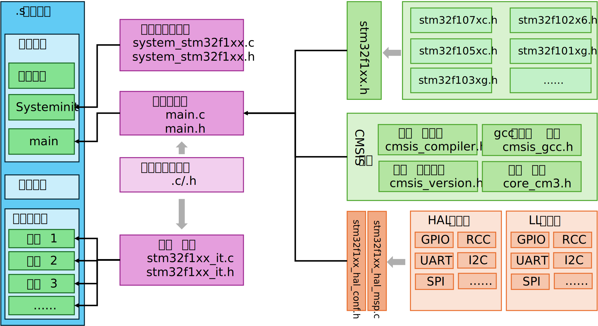

# HAL库

ST-HAL库可以在[官网](https://www.st.com.cn/zh/embedded-software/stm32cube-mcu-mpu-packages/products.html)下载

下载的`STM32Cube_FW_F1_V1.8.0`文件中只需要`Drivers`文件夹即可，其他可以删除：
```bash
STM32Cube_FW_F1_V1.8.0/
├── _htmresc
├── Documentation                           说明文档
├── Drivers                                 官方HAL库和内核源码
│   ├── STM32F1xx_HAL_Driver
│   ├── CMSIS
│   └── BSP
├── License.md                              md文档
├── Middlewares                             中间件、文件系统库等
├── package.xml                             无用文件
├── Projects                                示例程序
├── Readme.md                               md文档
├── Release_Notes.html                      版本说明
└── Utilities                               公共组件
```

在`Drivers`文件夹下的`STM32F1xx_HAL_Driver`、`CMSIS`和标准库类似，属于外设驱动和CMSIS内核，另一个`BSP`是官方开发版的板载驱动，可以忽略。

## HAL库外设驱动层

HAL外设驱动中关注`src`和`inc`文件夹，其他文件均可删除，文件夹内部的`Legacy`是兼容旧版库的遗留文件，也可以删除下文列出了HAL库驱动的所有文件及其功能，在实际开发中可以按需载入：

```bash
Drivers/STM32F1xx_HAL_Driver/
├── _htmresc
├── Inc                                    HAL头文件
├── Release_Notes.html
├── Src                                    HAL源文件
├── STM32F100xE_User_Manual.chm
├── STM32F103xB_User_Manual.chm
├── STM32F103xG_User_Manual.chm
└── STM32F107xC_User_Manual.chm
```


### HAL核心

下表中是最常用也是必须的核心依赖，主要涉及宏定义、初始化、时钟配置和GPIO操作：

| 头文件                    | 源文件                    | 功能                       |
|------------------------|------------------------|----------------------------------------------|
| stm32f1xx_hal_def.h    |                        | HAL 库通用定义（如状态枚举、宏函数、错误码） |
| stm32f1xx_hal.h        | stm32f1xx_hal.c        | HAL 库总入口头文件，包含所有核心模块的声明  |
| stm32f1xx_hal_cortex.h | stm32f1xx_hal_cortex.c | 内核模块                     |
| stm32f1xx_hal_rcc.h    | stm32f1xx_hal_rcc.c    | RCC模块，负责系统时钟、外设时钟的初始化    |
| stm32f1xx_hal_gpio.h   | stm32f1xx_hal_gpio.c   | GPIO 初始化/电平操作            |


### 外设驱动文件

下表是HAL库对STM32各个片上外设的封装，对应不同外设资源：

| 外设    | 头文件                       | 源文件                       | 功能                          |
|-------|---------------------------|---------------------------|-----------------------------|
| DMA   | stm32f1xx_hal_dma.h       | stm32f1xx_hal_dma.c       | 直接内存访问，减轻 CPU 负担            |
| 定时器   | stm32f1xx_hal_tim.h       | stm32f1xx_hal_tim.c       | 定时、PWM、输入捕获                 |
| RTC   | stm32f1xx_hal_rtc.h       | stm32f1xx_hal_rtc.c       | RTC（实时时钟）                   |
| EXTI  | stm32f1xx_hal_exti.h      | stm32f1xx_hal_exti.c      | 外部中断 / 事件控制器驱动              |
| WDG   | stm32f1xx_hal_iwdg.h      | stm32f1xx_hal_iwdg.c      | 独立看门狗                       |
| WDG   | stm32f1xx_hal_wwdg.h      | stm32f1xx_hal_wwdg.c      | 窗口看门狗                       |
| ADC   | stm32f1xx_hal_adc.h       | stm32f1xx_hal_adc.c       | 模数转换                        |
| DAC   | stm32f1xx_hal_dac.h       | stm32f1xx_hal_dac.c       | 数模转换                        |
| 串口    | stm32f1xx_hal_uart.h      | stm32f1xx_hal_uart.c      | 异步串口的基础功能                   |
| 串口    | stm32f1xx_hal_usart.h     | stm32f1xx_hal_usart.c     | 同步 + 异步串口的全功能               |
| I2C   | stm32f1xx_hal_i2c.h       | stm32f1xx_hal_i2c.c       | I2C 总线通信                    |
| SPI   | stm32f1xx_hal_spi.h       | stm32f1xx_hal_spi.c       | SPI 总线通信                    |
| CAN   | stm32f1xx_hal_can.h       | stm32f1xx_hal_can.c       | 控制器局域网通信                    |
| I2S   | stm32f1xx_hal_i2s.h       | stm32f1xx_hal_i2s.c       | I2S音频总线通信                   |
| 红外    | stm32f1xx_hal_irda.h      | stm32f1xx_hal_irda.c      | 实现红外通信协议                    |
| USB   | stm32f1xx_hal_hcd.h       | stm32f1xx_hal_hcd.c       | USB 主机控制器驱动                 |
| USB   | stm32f1xx_hal_pcd.h       | stm32f1xx_hal_pcd.c       | USB 从机通信                    |
| FLASH | stm32f1xx_hal_flash.h     | stm32f1xx_hal_flash.c     | 外部flash读写驱动                 |
| SDIO  | stm32f1xx_hal_sd.h        | stm32f1xx_hal_sd.c        | sd卡读写驱动                     |
| MMC   | stm32f1xx_hal_mmc.h       | stm32f1xx_hal_mmc.c       | MMC/SD 卡的读写功能               |
| NAND  | stm32f1xx_hal_nand.h      | stm32f1xx_hal_nand.c      | NAND 闪存的读写驱动                |
| NOR   | stm32f1xx_hal_nor.h       | stm32f1xx_hal_nor.c       | NOR 闪存的读写驱动                 |
| SRAM  | stm32f1xx_hal_sram.h      | stm32f1xx_hal_sram.c      | 外部 SRAM 的读写驱动               |
| 存储卡   | stm32f1xx_hal_pccard.h    | stm32f1xx_hal_pccard.c    | PCMCIA 卡 / 存储卡的驱动           |
| 智能卡   | stm32f1xx_hal_smartcard.h | stm32f1xx_hal_smartcard.c | 智能卡 / 银行卡的通信协议（ISO7816 标准）  |
| CEC   | stm32f1xx_hal_cec.h       | stm32f1xx_hal_cec.c       | HDMI 的 CEC 协议               |
| CRC   | stm32f1xx_hal_crc.h       | stm32f1xx_hal_crc.c       | CRC（循环冗余校验）                 |
| 以太网   | stm32f1xx_hal_eth.h       | stm32f1xx_hal_eth.c       | 以太网通信                       |
|电源管理|stm32f1xx_hal_pwr.h|	stm32f1xx_hal_pwr.c|	电源管理模块|

### 模板/辅助文件

此外，官方提供了四个模版配置文件，其中最重要的是`stm32f1xx_hal_conf_template.h`库函数配置文件，项目中需要通过该文件引入不同外设头文件。

| 模板文件                                        | 功能                             |
|---------------------------------------------|--------------------------------|
| stm32_assert_template.h                     | 断言配置模块，调试阶段检查参数合法性             |
| stm32f1xx_hal_conf_template.h               | HAL 库的总配置文件                    |
| stm32f1xx_hal_msp_template.c                | 负责硬件相关的底层配置（如时钟使能、中断优先级、引脚复用）  |
| stm32f1xx_hal_timebase_rtc_alarm_template.c | RTC 闹钟作为延时基准模板                 |
| stm32f1xx_hal_timebase_tim_template.c       | 定时器作为延时基准模板                    |

### HAL扩展库

下表是针对外设资源的拓展函数，提供更为丰富的操作功能：

| 头文件                      | 源文件                      | 功能         |
|--------------------------|--------------------------|------------|
| stm32f1xx_hal_tim_ex.h   | stm32f1xx_hal_tim_ex.c   | 定时器拓展      |
| stm32f1xx_hal_dac_ex.h   | stm32f1xx_hal_dac_ex.c   | DAC拓展      |
| stm32f1xx_hal_adc_ex.h   | stm32f1xx_hal_adc_ex.c   | ADC拓展      |
| stm32f1xx_hal_dma_ex.h   |                          | DMA拓展      |
| stm32f1xx_hal_flash_ex.h | stm32f1xx_hal_flash_ex.c | FLASH驱动拓展  |
| stm32f1xx_hal_gpio_ex.h  | stm32f1xx_hal_gpio_ex.c  | GPIO拓展     |
| stm32f1xx_hal_pcd_ex.h   | stm32f1xx_hal_pcd_ex.c   | USB拓展      |
| stm32f1xx_hal_rcc_ex.h   | stm32f1xx_hal_rcc_ex.c   | RCC时钟拓展    |
| stm32f1xx_hal_rtc_ex.h   | stm32f1xx_hal_rtc_ex.c   | RTC时钟拓展    |


### LL 库文件

LL库是和HAL相似但更加底层的封装，是ST在HAL库框架下推出的轻量底层驱动，只封装了寄存器操作，无冗余代码。

| 头文件                   | 源文件                  | 功能                  |
|-----------------------|----------------------|---------------------|
| stm32f1xx_ll_bus.h    |                      | 总线（AHB/APB）寄存器操作封装  |
| stm32f1xx_ll_cortex.h |                      | Cortex-M3 内核寄存器操作   |
| stm32f1xx_ll_system.h |                      | 系统级寄存器操作            |
| stm32f1xx_ll_utils.h  | stm32f1xx_ll_utils.c | LL 库通用工具            |
| stm32f1xx_ll_gpio.h   | stm32f1xx_ll_gpio.c  | GPIO 寄存器操作          |
| stm32f1xx_ll_rcc.h    | stm32f1xx_ll_rcc.c   | RCC 时钟寄存器操作         |
| stm32f1xx_ll_exti.h   | stm32f1xx_ll_exti.c  | EXTI 中断寄存器操作        |
| stm32f1xx_ll_tim.h    | stm32f1xx_ll_tim.c   | 定时器寄存器操作            |
| stm32f1xx_ll_rtc.h    | stm32f1xx_ll_rtc.c   | RTC 实时时钟寄存器操作       |
| stm32f1xx_ll_dma.h    | stm32f1xx_ll_dma.c   | DMA 寄存器操作           |
| stm32f1xx_ll_usart.h  | stm32f1xx_ll_usart.c | USART 串口寄存器操作       |
| stm32f1xx_ll_i2c.h    | stm32f1xx_ll_i2c.c   | I2C 寄存器操作           |
| stm32f1xx_ll_spi.h    | stm32f1xx_ll_spi.c   | SPI 寄存器操作           |
| stm32f1xx_ll_dac.h    | stm32f1xx_ll_dac.c   | DAC 寄存器操作           |
| stm32f1xx_ll_adc.h    | stm32f1xx_ll_adc.c   | ADC 寄存器操作           |
| stm32f1xx_ll_sdmmc.h  | stm32f1xx_ll_sdmmc.c | SDMMC 寄存器操作         |
| stm32f1xx_ll_fsmc.h   | stm32f1xx_ll_fsmc.c  | FSMC 寄存器操作          |
| stm32f1xx_ll_iwdg.h   |                      | 独立看门狗寄存器操作          |
| stm32f1xx_ll_crc.h    | stm32f1xx_ll_crc.c   | CRC 硬件寄存器操作         |
| stm32f1xx_ll_pwr.h    | stm32f1xx_ll_pwr.c   | 电源管理寄存器操作           |


## 内核代码

HAL库的CMSIS内核部分比标准库更加丰富，ST官方提供了一些预编译文件、RTOS支持、信号处理和神经网络扩展，下面是对文件夹的介绍。文件夹中的`Include`和`Core`中的文件重复，可能是官方的冗余保障，实际开发中只需要保留一个即可：

```bash
Drivers/CMSIS/
├── ARM.CMSIS.pdsc                          一些IDE需要的配置文件
├── Core                                    Cortex-M 系列内核
├── Core_A                                  Cortex-A 系列内核
├── Device                                  设备初始化函数
├── docs                                    说明文档
├── DSP                                     信号处理相关的库
├── Include                                 CMSIS 通用头文件（与Core中重复）
├── Lib                                     预编好的库文件
├── LICENSE.txt                             许可证
├── NN                                      神经网络相关的库
├── README.md                               说明文档
├── RTOS                                    CMSIS-RTOS v1 标准
└── RTOS2                                   CMSIS-RTOS v2 标准
```

介绍一下`Core`文件夹下的内核头文件，其中的`Template`文件夹可以删除：
```bash
Core/
├── Include
│   ├── cmsis_armcc.h                       ARMcc编译器（Keil）
│   ├── cmsis_armclang.h                    ARMClang编译器
│   ├── cmsis_compiler.h                    编译器适配总入口
│   ├── cmsis_gcc.h                         ARMgcc编译器
│   ├── cmsis_iccarm.h                      IAR编译器
│   ├── cmsis_version.h                     cmsis版本信息
│   ├── core_armv8mbl.h                     Cortex-M23内核
│   ├── core_armv8mml.h                     Cortex-M33内核
│   ├── core_cm0.h                          Cortex-M0内核
│   ├── core_cm0plus.h                      Cortex-M0+内核
│   ├── core_cm1.h                          Cortex-M1内核
│   ├── core_cm23.h                         
│   ├── core_cm3.h                          Cortex-M3内核
│   ├── core_cm33.h
│   ├── core_cm4.h                          Cortex-M4内核
│   ├── core_cm7.h                          Cortex-M7内核
│   ├── core_sc000.h                        Cortex-SC000内核
│   ├── core_sc300.h                        Cortex-SC300内核
│   ├── mpu_armv7.h                         ARMv7-M架构的内存保护模块
│   ├── mpu_armv8.h                         ARMv8-M架构的内存保护模块
│   └── tz_context.h                        ARM TrustZone安全扩展的上下文管理
└── Template                                示例代码可以删除
    └── ARMv8-M
        ├── main_s.c
        └── tz_context.c
```

## 设备驱动代码

这一部分主要是各型号的寄存器地址、适配各编译器的启动文件和链接脚本映射我们只保留`Include`文件夹和`Source/Templates/gcc`文件夹，以及`system_stm32f1xx.c`文件。

```bash
Device/ST/STM32F1xx
├── Include                                 各型号寄存器地址映射头文件
│   ├── stm32f100xb.h
│   ├── stm32f100xe.h
│   ├── stm32f101x6.h
│   ├── stm32f101xb.h
│   ├── stm32f101xe.h
│   ├── stm32f101xg.h
│   ├── stm32f102x6.h
│   ├── stm32f102xb.h
│   ├── stm32f103x6.h
│   ├── stm32f103xb.h
│   ├── stm32f103xe.h
│   ├── stm32f103xg.h
│   ├── stm32f105xc.h
│   ├── stm32f107xc.h
│   ├── stm32f1xx.h                         STM32F1xx系列总头文件
│   └── system_stm32f1xx.h                  系统初始化配套头文件    
├── Release_Notes.html                      版本说明
└── Source
    └── Templates
        ├── arm                             arm编译器启动文件
        ├── gcc                             gcc编译器启动文件
        ├── iar                             iar编译器启动文件
        └── system_stm32f1xx.c              系统初始化函数
```

## 启动/链接脚本

在`gcc`文件夹中又分为`.s`启动文件和`/linker/*.ld`链接脚本文件这些都是编译所需的文件夹：

```bash
gcc/
├── linker                                  各型号链接脚本文件
│   ├── STM32F100XB_FLASH.ld
│   ├── STM32F100XE_FLASH.ld
│   ├── STM32F101X6_FLASH.ld
│   ├── STM32F101XB_FLASH.ld
│   ├── STM32F101XE_FLASH.ld
│   ├── STM32F101XG_FLASH.ld
│   ├── STM32F102X6_FLASH.ld
│   ├── STM32F102XB_FLASH.ld
│   ├── STM32F103X6_FLASH.ld
│   ├── STM32F103XB_FLASH.ld
│   ├── STM32F103XE_FLASH.ld
│   ├── STM32F103XG_FLASH.ld
│   ├── STM32F105XC_FLASH.ld
│   └── STM32F107XC_FLASH.ld
├── startup_stm32f100xb.s                   各型号启动文件
├── startup_stm32f100xe.s
├── startup_stm32f101x6.s
├── startup_stm32f101xb.s
├── startup_stm32f101xe.s
├── startup_stm32f101xg.s
├── startup_stm32f102x6.s
├── startup_stm32f102xb.s
├── startup_stm32f103x6.s
├── startup_stm32f103xb.s
├── startup_stm32f103xe.s
├── startup_stm32f103xg.s
├── startup_stm32f105xc.s
└── startup_stm32f107xc.s
```

## HAL库项目架构

我们把HAL库的项目必须文件整理出来，构建如下工程目录。

```bash
.
├── build                                   编译目录     
├── CMakeLists.txt                          工程cmake脚本
├── Drivers                                 驱动层
│   ├── CMSIS                               CMSIS内核层代码
│   │   ├── cmsis_compiler.h                编译器选择
│   │   ├── cmsis_gcc.h                     gcc编译器配置
│   │   ├── cmsis_version.h                 内核版本标识
│   │   ├── core_cm3.h                      内核源码
│   │   ├── STM32F1xx/                      不同系列寄存器映射
│   │   ├── stm32f1xx.h                     寄存器头文件选择
│   │   ├── system_stm32f1xx.c              系统时钟初始化源文件
│   │   └── system_stm32f1xx.h              系统时钟初始化头文件
│   ├── Start                               启动文件
│   │   ├── boot/                           .s启动文件
│   │   └── linker/                         .ld链接脚本
│   └── STM32F1xx_HAL_Driver/               HAL库源码
│       ├── Inc/                            HAL源文件
│       └── Src/                            HAL头文件
├── openocd.cfg                             openocd配置
└── User                                    用户代码
    ├── main.c                              main函数入口
    ├── main.h                              main函数头文件
    ├── stm32f1xx_hal_conf.h                HAL头文件配置项
    ├── stm32f1xx_hal_msp.c                 外设msp初始化
    ├── stm32f1xx_it.c                      中断函数源文件
    └── stm32f1xx_it.h                      中断函数源文件
```

HAL库的项目架构如下图，启动文件部分和标准库基本一致，上电后先使用默认时钟配置，随后交由用户程序控制，在HAL库中对设备进行了深层次抽象 `stm32f1xx.h` 文件中实现了对 `STM32F1xx` 文件夹中不同系列芯片寄存器地址映射头文件的选择，`stm32f1xx_hal_conf.h` 负责启用哪一部分的HAL驱动文件，而 `stm32f1xx_hal_msp.c` 文件则负责对底层设备的配置，这样可以实现多型号适配和代码分层管理。



## cmake脚本

最后在项目根目录创建`CMakeLists.txt`文件，做如下配置即可编译（需要修改本地Armgcc工具链路径）：

```c
cmake_minimum_required(VERSION 3.22)

# 声明交叉编译环境
set(CMAKE_SYSTEM_NAME Generic)
set(CMAKE_SYSTEM_PROCESSOR arm)
set(CMAKE_TRY_COMPILE_TARGET_TYPE STATIC_LIBRARY)

# 设置编译工具链ARM-GCC
set(ARM_TOOLCHAIN_PATH "/Applications/ArmGNUToolchain/15.2.rel1/arm-none-eabi/bin/")        // [!code error]
set(CMAKE_C_COMPILER "${ARM_TOOLCHAIN_PATH}arm-none-eabi-gcc")
set(CMAKE_ASM_COMPILER "${ARM_TOOLCHAIN_PATH}arm-none-eabi-gcc")
set(CMAKE_OBJCOPY "${ARM_TOOLCHAIN_PATH}arm-none-eabi-objcopy")

# 设置编译选项
set(CMAKE_C_STANDARD 11)
set(CMAKE_C_STANDARD_REQUIRED ON)
set(CMAKE_C_EXTENSIONS ON)

# 定义编译类型
if(NOT CMAKE_BUILD_TYPE)
    set(CMAKE_BUILD_TYPE "Debug")
endif()

# 项目名称
set(CMAKE_PROJECT_NAME hal)
set(CMAKE_EXPORT_COMPILE_COMMANDS TRUE)

# 核心项目配置
project(${CMAKE_PROJECT_NAME})
message("Build type: " ${CMAKE_BUILD_TYPE})

# 启用C和ASM汇编
enable_language(C ASM)

# 可执行文件名称
add_executable(${CMAKE_PROJECT_NAME})

# 设置CPU参数
set(CPU_FLAGS
    -mcpu=cortex-m3
    -mthumb
    -mfloat-abi=soft
)

# 设置编译宏定义
set(COMPILE_DEFS
    STM32F103xB
    USE_HAL_DRIVER
)
# 宏定义
target_compile_definitions(
    ${CMAKE_PROJECT_NAME} PRIVATE ${COMPILE_DEFS}
)

# 链接脚本路径
set(LINKER_SCRIPT "${CMAKE_SOURCE_DIR}/Drivers/Start/linker/STM32F103XB_FLASH.ld")
# 启动文件路径
set(BOOT_SCRIPT "${CMAKE_SOURCE_DIR}/Drivers/Start/boot/startup_stm32f103xb.s")


target_sources(${CMAKE_PROJECT_NAME} PRIVATE
    # User层
    ${CMAKE_SOURCE_DIR}/User/main.c
    # CMSIS系统初始化文件
    ${CMAKE_SOURCE_DIR}/Drivers/CMSIS/system_stm32f1xx.c
    # HAL库核心文件
    ${CMAKE_SOURCE_DIR}/Drivers/STM32F1xx_HAL_Driver/Src/stm32f1xx_hal.c
    ${CMAKE_SOURCE_DIR}/Drivers/STM32F1xx_HAL_Driver/Src/stm32f1xx_hal_gpio.c
    ${CMAKE_SOURCE_DIR}/Drivers/STM32F1xx_HAL_Driver/Src/stm32f1xx_hal_rcc.c
    ${CMAKE_SOURCE_DIR}/Drivers/STM32F1xx_HAL_Driver/Src/stm32f1xx_hal_cortex.c
    # 启动文件
    ${BOOT_SCRIPT}
)

# 定义头文件目录列表
set(INCLUDE_DIRS
    # User层头文件
    ${CMAKE_SOURCE_DIR}/User
    # HAL库核心头文件
    ${CMAKE_SOURCE_DIR}/Drivers/STM32F1xx_HAL_Driver/Inc
    # STM32F1xx设备专属头文件
    ${CMAKE_SOURCE_DIR}/Drivers/CMSIS/STM32F1xx
    # CMSIS系统头文件（stm32f1xx.h/system_stm32f1xx.h）
    ${CMAKE_SOURCE_DIR}/Drivers/CMSIS
)

# 将所有头文件目录添加到工程
target_include_directories(
    ${CMAKE_PROJECT_NAME} PRIVATE ${INCLUDE_DIRS}
)

# 编译选项
target_compile_options(${CMAKE_PROJECT_NAME} PRIVATE
    ${CPU_FLAGS}
    $<$<CONFIG:Debug>:-O0 -g3>
    $<$<CONFIG:Release>:-Os -g0>
    -Wall
    -ffunction-sections
    -fdata-sections
    $<$<COMPILE_LANGUAGE:ASM>:-x assembler-with-cpp>
)

# 链接参数
target_link_options(${CMAKE_PROJECT_NAME} PRIVATE
    # CPU 架构相关参数
    ${CPU_FLAGS}
    # 指定链接脚本
    -T${LINKER_SCRIPT}
    # 启用垃圾回收
    -Wl,--gc-sections
    # 指定程序入口点
    -Wl,-e,Reset_Handler
    # 消除警告
    -Wl,--no-warn-rwx-segments
)

# 链接库文件
target_link_libraries(${CMAKE_PROJECT_NAME} PRIVATE
    gcc
    c
)

# 生成hex/bin文件
add_custom_command(TARGET ${CMAKE_PROJECT_NAME} POST_BUILD
    COMMAND ${CMAKE_OBJCOPY} -O ihex $<TARGET_FILE:${CMAKE_PROJECT_NAME}> ${CMAKE_PROJECT_NAME}.hex
    COMMAND ${CMAKE_OBJCOPY} -O binary $<TARGET_FILE:${CMAKE_PROJECT_NAME}> ${CMAKE_PROJECT_NAME}.bin
    # 打印固件Flash/RAM占用
    COMMAND ${ARM_TOOLCHAIN_PATH}arm-none-eabi-size $<TARGET_FILE:${CMAKE_PROJECT_NAME}>
    COMMENT "Generated: ${CMAKE_PROJECT_NAME}.hex ${CMAKE_PROJECT_NAME}.bin"
)
```

## LED闪烁

复制如下代码到`main.c`中，实现翻转`PC13`引脚电平的小灯闪烁。

```c
#include "stm32f1xx_hal.h"


GPIO_InitTypeDef GPIO_InitStruct = {0};


void SysTick_Handler(void)
{
  HAL_IncTick();
}

#define LED_DELAY 500

int main(void)
{
  HAL_Init();

  RCC_OscInitTypeDef RCC_OscInitStruct = {0};
  RCC_OscInitStruct.OscillatorType = RCC_OSCILLATORTYPE_HSI;
  RCC_OscInitStruct.HSIState = RCC_HSI_ON;
  RCC_OscInitStruct.HSICalibrationValue = RCC_HSICALIBRATION_DEFAULT;
  RCC_OscInitStruct.PLL.PLLState = RCC_PLL_ON;
  RCC_OscInitStruct.PLL.PLLSource = RCC_PLLSOURCE_HSI_DIV2;
  RCC_OscInitStruct.PLL.PLLMUL = RCC_PLL_MUL16;
  HAL_RCC_OscConfig(&RCC_OscInitStruct);

  RCC_ClkInitTypeDef RCC_ClkInitStruct = {0};
  RCC_ClkInitStruct.ClockType = RCC_CLOCKTYPE_SYSCLK;
  RCC_ClkInitStruct.SYSCLKSource = RCC_SYSCLKSOURCE_PLLCLK;
  RCC_ClkInitStruct.AHBCLKDivider = RCC_SYSCLK_DIV1;
  RCC_ClkInitStruct.APB1CLKDivider = RCC_HCLK_DIV2;
  RCC_ClkInitStruct.APB2CLKDivider = RCC_HCLK_DIV1;
  HAL_RCC_ClockConfig(&RCC_ClkInitStruct, FLASH_LATENCY_2);

  __HAL_RCC_GPIOC_CLK_ENABLE();
  
  GPIO_InitStruct.Pin = GPIO_PIN_13;          
  GPIO_InitStruct.Mode = GPIO_MODE_OUTPUT_PP; 
  GPIO_InitStruct.Pull = GPIO_NOPULL;         
  GPIO_InitStruct.Speed = GPIO_SPEED_FREQ_LOW;
  HAL_GPIO_Init(GPIOC, &GPIO_InitStruct);


  while (1)
  {
    HAL_GPIO_WritePin(GPIOC, GPIO_PIN_13, GPIO_PIN_RESET);
    HAL_Delay(LED_DELAY);
    
    HAL_GPIO_WritePin(GPIOC, GPIO_PIN_13, GPIO_PIN_SET);
    HAL_Delay(LED_DELAY);
  }
}


void Error_Handler(void)
{
  while(1);
}

#ifdef USE_FULL_ASSERT
void assert_failed(uint8_t *file, uint32_t line)
{
}
#endif
```

## 编译

```bash
mkdir build
cd build
cmake -G Ninja ..
njnja
```

出现如下提示即证明编译成功，同时`build`文件夹下生成了`hal.hex`、`hal.bin`两个文件。

```bash
(base) user@192 build % cmake -G Ninja ..
-- The C compiler identification is GNU 15.2.1
-- The CXX compiler identification is GNU 15.2.1
-- Detecting C compiler ABI info
-- Detecting C compiler ABI info - done
-- Check for working C compiler: /Applications/ArmGNUToolchain/15.2.rel1/arm-none-eabi/bin/arm-none-eabi-gcc - skipped
-- Detecting C compile features
-- Detecting C compile features - done
-- Detecting CXX compiler ABI info
-- Detecting CXX compiler ABI info - done
-- Check for working CXX compiler: /Applications/ArmGNUToolchain/15.2.rel1/arm-none-eabi/bin/arm-none-eabi-c++ - skipped
-- Detecting CXX compile features
-- Detecting CXX compile features - done
Build type: Debug
-- The ASM compiler identification is GNU
-- Found assembler: /Applications/ArmGNUToolchain/15.2.rel1/arm-none-eabi/bin/arm-none-eabi-gcc
-- Configuring done (0.5s)
-- Generating done (0.0s)
-- Build files have been written to: /stm32/stm hal/build

(base) user@192 build % ninja            
[8/8] Linking C executable hal; Generated: hal.hex hal.bin
   text    data     bss     dec     hex filename
   4920      28    1976    6924    1b0c /stm32/stm hal/build/hal
```

## 烧录

随后编写如下`openocd.cfg`配置文件：

```bash

source [find interface/stlink.cfg]

source [find target/stm32f1x.cfg]

adapter speed 1000


# 定义烧录函数
proc flash_program {hex_file} {
    # 初始化调试器
    init
    # 复位并暂停芯片
    reset halt
    # 擦除所有扇区
    flash erase_sector 0 0 last
    # 烧录hex文件并校验
    program $hex_file verify
    # 复位运行程序
    reset
    # 退出OpenOCD
    shutdown
}
```

执行命令：

```bash
openocd -f ../openocd.cfg -c "flash_program hal.hex"
```

随后看到如下输出即可说明烧录完成

```bash
Open On-Chip Debugger 0.12.0
Licensed under GNU GPL v2
For bug reports, read
        http://openocd.org/doc/doxygen/bugs.html
Info : auto-selecting first available session transport "hla_swd". To override use 'transport select <transport>'.
Info : The selected transport took over low-level target control. The results might differ compared to plain JTAG/SWD
flash_program
Info : clock speed 1000 kHz
Info : STLINK V2J29S7 (API v2) VID:PID 0483:3748
Info : Target voltage: 3.266357
Info : [stm32f1x.cpu] Cortex-M3 r1p1 processor detected
Info : [stm32f1x.cpu] target has 6 breakpoints, 4 watchpoints
Info : starting gdb server for stm32f1x.cpu on 3333
Info : Listening on port 3333 for gdb connections
[stm32f1x.cpu] halted due to debug-request, current mode: Thread 
xPSR: 0x01000000 pc: 0x080012b4 msp: 0x20004ffc
Info : device id = 0x20036410
Info : flash size = 128 KiB
[stm32f1x.cpu] halted due to debug-request, current mode: Thread 
xPSR: 0x01000000 pc: 0xfffffffe msp: 0xfffffffc
** Programming Started **
Warn : Adding extra erase range, 0x08001354 .. 0x080013ff
** Programming Finished **
** Verify Started **
** Verified OK **
shutdown command invoked
```